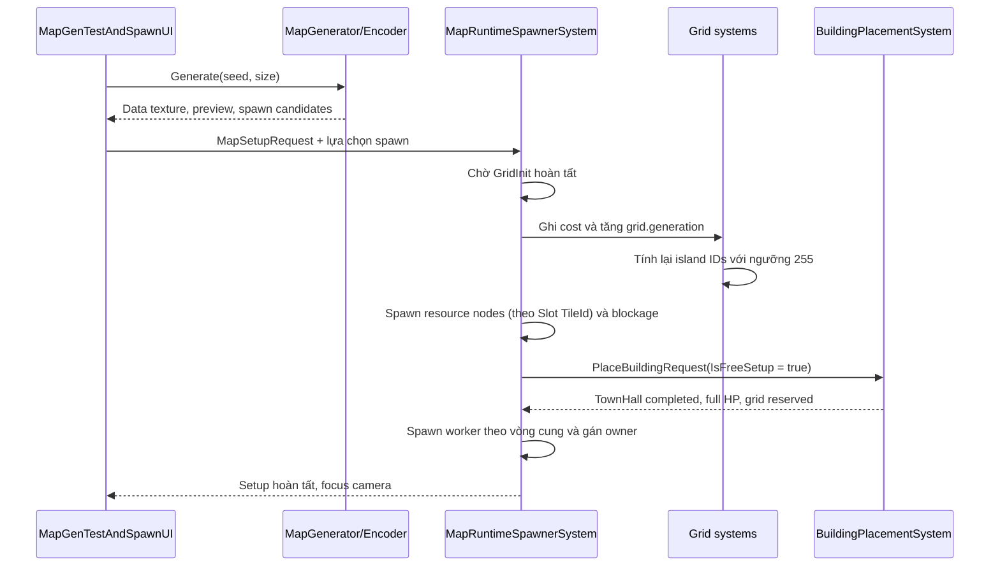

# Kế Hoạch Triển Khai MapGen, Data Texture và Player Spawn

> Bổ sung policy connectivity: phải thử nối **mọi island**, không chỉ base, trước khi lấp. Chỉ pocket không có base, ≤64 ô và tổng lấp ≤2% grid được chuyển thành núi khi không nối được; vùng lớn không nối được phải reject/retry (tối đa 16 candidate). Resource chỉ block footprint và không được làm xuất hiện island mới. Chi tiết pipeline và kết quả seed 30000 nằm trong tài liệu thuật toán chuẩn bên dưới.

> Quyết định terrain cập nhật 2026-10-02: [MapGen_Lab5_AcceptedAlgorithm.md](MapGen_Lab5_AcceptedAlgorithm.md) là nguồn chuẩn cho thuật toán đã chọn. Các luật mới gồm common Y, integer HeightLevel, cliff/ramp bake vào walkable, 2–10 người, vùng bảo vệ 4–16 ô, **đúng 1 island sau clearance và resource occupancy**, pocket bị loại chuyển thành núi. Ưu tiên những luật này nếu mô tả terrain cũ bên dưới mâu thuẫn. Lab đã kiểm chứng; chưa xác nhận đã port vào Unity.

> Cập nhật trạng thái: 2026-09-29. Tài liệu này là kế hoạch triển khai hiện hành cho Hạng mục B. Các mô tả trạng thái source bên dưới đã được đối chiếu với working tree tại thời điểm cập nhật.

## 1. Thứ tự ưu tiên

Triển khai **Hạng mục B — MapGen, Data-Packed Texture và Player Spawn** trước.

**Hạng mục A — Sprint 0 Multiplayer** được giữ trong backlog và thực hiện sau khi Hạng mục B hoàn tất. Backlog gồm:

- `LocalPlayerManager.cs` và chuyển các UI/input consumer khỏi `PlayerContextAuthoring` trong SubScene.
- `MatchDataContracts.cs`.
- `MatchStateComponent.cs` / `MatchPlayingTag`.
- Cập nhật `SelectManager`, `UnitController`, `CommandMenu`, `CommandButton` và `UnitImage`.

Chi tiết audit của Hạng mục A vẫn được lưu tại [Sprint0_CodeAudit.md](Sprint0_CodeAudit.md).

## 2. Trạng thái source và các ràng buộc cần xử lý

### 2.1 `GridIslandSystem` đã thống nhất ngưỡng vật cản và tránh flood-fill lặp

Quy ước chung của pathfinding, blockage và MapGen là:

- `cost < 255`: ô có thể đi.
- `cost >= 255`: ô bị chặn.

Working tree hiện đã xử lý đúng hai yêu cầu:

- Reset toàn bộ `islandBuffer` về `islandID = 0` trước mỗi lần tính lại.
- Bỏ qua ô đã được flood-fill bằng `islandBuffer[i].islandID != 0 || visited[i]`.

Nhờ đó, mỗi vùng walkable liên thông chỉ mở một flood-fill và giữ một island ID. Ô có `cost >= 255` được bỏ qua và giữ `islandID = 0`.

Logic hiện tại đúng nhưng đang lưu trạng thái đã duyệt ở cả `islandBuffer` và `NativeArray<bool> visited`. Vì buffer đã được reset đầu lượt, có thể tối ưu sau bằng cách bỏ `visited` và dùng `islandID != 0` làm dấu hiệu đã duyệt:

```csharp
if (islandBuffer[i].islandID != 0)
    continue;

if (costBuffer[i].cost >= 255)
{
    islandBuffer[i] = new GridIsland { islandID = 0 };
    continue;
}
```

Trong BFS, chỉ enqueue láng giềng khi `islandID == 0` và `cost < 255`. Đây là tối ưu tùy chọn; implementation hiện tại vẫn đúng. Các kiểm tra láng giềng tiếp tục dùng `>= 255` cho vật cản và `< 255` cho ô có thể đi.

### 2.2 Map data chỉ được ghi sau `GridInitSystem`

`GridInitSystem` chạy lần đầu trong `FixedStepSimulationSystemGroup`, resize hai buffer và đặt toàn bộ `GridNodeCost.cost = 1`, sau đó tự tắt.

Nếu MapGen ghi Kênh B trước thời điểm này, dữ liệu núi và vật cản sẽ bị xóa. `MapRuntimeSpawnerSystem` phải chờ:

```text
GridNodeCost.Length == grid.width * grid.height
GridIsland.Length   == grid.width * grid.height
```

Sau đó mới ghi cost từ map và tăng `grid.generation` để `GridIslandSystem` tính lại đảo.

Không dùng riêng độ dài buffer làm tín hiệu cho các lần regenerate tiếp theo. `MapSetupRequest` cần có trạng thái xử lý một lần hoặc generation/version riêng để tránh spawn trùng tài nguyên, TownHall và worker.

### 2.3 TownHall khởi đầu cần nhánh setup miễn phí

`BuildingPlacementSystem` hiện yêu cầu:

1. Có `PlaceBuildingWorkerElement` trỏ tới worker cùng owner và có `BuildOffer` phù hợp.
2. Người chơi đủ tài nguyên rồi trừ chi phí.
3. Công trình bắt đầu ở `ConstructionPhase.Planned`, `CompletedWork = 0` và HP tối đa 1.

Setup Frame cần thêm `IsFreeSetup` vào `PlaceBuildingRequest`. Với request này, system vẫn phải kiểm tra prefab, vị trí và vùng đặt hợp lệ, nhưng:

- Bỏ yêu cầu worker/`BuildOffer`.
- Không kiểm tra hoặc trừ tài nguyên.
- Khởi tạo `CompletedWork = WorkLoad` và `Phase = Completed`.
- Khởi tạo `CurrentHP = MaxHP` và đánh dấu health đã đổi.
- Vẫn reserve grid, bật `BlockageNeedBakeTag`, gán owner và tạo `PopulationAccount` như pipeline chuẩn.

Các request gameplay thông thường giữ nguyên hành vi hiện tại.

### 2.4 Prefab của MapGen và Slot Tài nguyên động phải được authoring rõ ràng

`Assets/Resources/GameReg.asset` hiện có `Buildings: []`. Resource prefab (`Crystal.prefab`) dùng `ResourceAuthoring` và registry chưa có catalog riêng cho resource/rock visual.

Để không phụ thuộc cứng vào tên tài nguyên khi danh mục `ResourceType` còn đang mở rộng, `MapGen` dùng cơ chế **Slot Tài Nguyên Động (`MapResourceSlotConfig` & `MapResourcePrefabEntry`)**:

- Mỗi Slot ánh xạ `byte TileId` (`10..49` trên Kênh G) với một giá trị enum `ResourceType` bất kỳ và một `GameObject ResourcePrefab`.
- Giai đoạn test MapGen dùng `MapSpawnerConfigAuthoring` trong SubScene để kéo thả trực tiếp:
  - TownHall prefab.
  - Worker prefab.
  - Danh sách `ResourceSlots` (`TileId`, `ResourceType`, `Prefab`).
  - Rock visual prefab, nếu cần hiển thị 3D.

Baker chuyển các reference trên thành Entity prefab trong `MapSpawnerPrefabConfig` và `DynamicBuffer<MapResourcePrefabEntry>`.

### 2.5 Pathfinding cho vật cản tự nhiên (`cost >= 255`) và công trình đã hoàn tất (2026-09-29)

Hệ thống Movement Agent hiện đã hoàn tất việc phân biệt và xử lý hai loại vật cản trên bản đồ:

- **Vật cản công trình (`BuildingBlockage`)**: Kiểm tra theo phạm vi ô lưới `[bMinGrid .. bMaxGrid]` thông qua `NaturalBlockedTargetResolver.TryGetBlockageGridBounds`. Nếu footprint công trình lấn qua ô nào thì toàn bộ ô đó được tính là thuộc công trình và giữ nguyên logic chọn điểm đứng quanh chu vi công trình.
- **Vật cản tự nhiên (`NaturalResolved`)**: Khi người chơi click vào núi đá / vùng nước có `cost >= 255` và không thuộc `BlockageData`, `NaturalBlockedTargetResolver.TryResolveTarget` tự động quét 4 hướng cố định (**Bắc → Đông → Nam → Tây**), đo khoảng cách XZ chính xác từ điểm click tới cạnh vào (entry edge) của ô walkable đầu tiên mỗi hướng (ngưỡng tie-break `0.0001f`) và lấy tâm ô thắng cuộc làm `navigationTargetCell`.
- **Tối ưu Cache một lần**: Quá trình resolve chỉ diễn ra một lần tại `FlowFieldAssignmentSystem` khi xử lý `TargetChangeRequest`, lưu trạng thái (`navigationTargetCell`, `targetResolutionGeneration`, `targetResolutionKind`) vào `MovementAgentComponent`, và chỉ tự động yêu cầu resolve lại khi `grid.generation` thay đổi đối với `NaturalResolved`. Nhờ đó, dữ liệu địa hình núi/nước (`WalkCost = 255`) do MapGen nạp vào Kênh B đã hoàn toàn tương thích với điều hướng của Unit.

## 3. File sẽ tạo & Tài liệu Giáo trình / Labs đi kèm

* 📘 **Giáo trình Lý thuyết & Toán học MapGen:** [MapGen_Noise_RNG_Curriculum.md](MapGen_Noise_RNG_Curriculum.md)
* 🧪 **Các Phòng thí nghiệm tương tác (HTML Labs):**
  * [Lab 1: Bitwise, PRNG (SplitMix32 + Xorshift32) & Vành Khuyên Base](Labs/Lab1_Bitwise_PRNG_Annulus.html)
  * [Lab 2: Lerp, Quintic Fade, Bilinear Interpolation & Tích Vô Hướng](Labs/Lab2_Lerp_Fade_Bilinear_DotProduct.html)
  * [Lab 3: Vector Perlin Noise 2D, Chồng Sóng fBm & 4 Bước RTS MapGen](Labs/Lab3_PerlinVectors_fBm_RTSMapGen.html)

| File | Trách nhiệm |
|---|---|
| `MapGen/MapNoiseAndRng.cs` | `DeterministicRng` (SplitMix32 + Xorshift32 + lấy mẫu vành khuyên) và `SeededPerlinNoise2D` (Perlin 2D + fBm theo bảng hoán vị trộn từ seed). |
| `MapGen/MapGenData.cs` | `MapTileType`, `MapCellData`, `MapResourceSlotConfig` (gài enum `ResourceType` động), `MapModeConfig` (Bán kính Base 2 lớp `TownHallClearRadius` & `BaseProtectedRadius`), `SpawnCandidateData`, `MapSetupRequest` và ECS config cần thiết. |
| `MapGen/MapGenerator.cs` | Sinh map theo seed và mode, bảo vệ Base 2 lớp + exit corridor, sinh núi fBm, lọc 1 đảo walkable duy nhất và phân bổ tài nguyên khởi đầu nằm gọn trong `BaseProtectedRadius` + tài nguyên trung lập theo quota. |
| `MapGen/MapTextureEncoder.cs` | Encode/decode RGBA32 và PNG; tạo preview texture tách khỏi data texture. |
| `MapGen/MapRuntimeSpawner.cs` | Chờ grid init, nạp cost, spawn resource theo bảng ánh xạ `TileId -> ResourceType`, gửi request TownHall và sinh worker một lần. |
| `MapGen/MapSpawnerConfigAuthoring.cs` | Bake các prefab cấu hình trong SubScene sang Entity prefab và buffer `MapResourcePrefabEntry`. |
| `ClientSide (Presentation)/UI/MapGenTestAndSpawnUI.cs` | UI nhập seed/kích thước, preview map, chọn spawn và gửi setup request. |

Các file MapGen đặt dưới `Assets/Scripts/Game(New Simulation Logic)/`. UI đặt dưới `Assets/Scripts/ClientSide (Presentation)/UI/`.

## 4. File hiện có sẽ sửa (Tác động tối thiểu vào Core)

| File | Thay đổi |
|---|---|
| `BuildingPlacementComponents.cs` | Thêm `bool IsFreeSetup` vào `PlaceBuildingRequest`. |
| `BuildingPlacementSystem.cs` | Thêm nhánh setup miễn phí và tạo công trình hoàn tất/full HP. |
| `GridIslandSystem.cs` | Thay đổi trong working tree đã dùng ngưỡng `255`, reset island buffer và bỏ qua ô đã duyệt. Giữ nguyên, không cần sửa thêm. |

## 5. Hợp đồng dữ liệu MapGen

### 5.1 Tile type

| Giá trị | Ý nghĩa |
|---:|---|
| `0` | Walkable ground |
| `1` | Water/unwalkable |
| `2` | Rock obstacle |
| `10..49` | Resource node theo Slot cấu hình (`MapResourceSlotConfig`, mặc định `10` = Slot 0, `11` = Slot 1...) |
| `50..53` | Spawn candidate 0..3 |

### 5.2 Data texture RGBA32

| Kênh | Dữ liệu |
|---|---|
| R | Height 0..255 |
| G | Tile/entity type |
| B | Walk cost; 255 là blocked |
| A | Resource density; runtime amount = A × 100 |

Data texture dùng `FilterMode.Point` và `TextureWrapMode.Clamp`. Preview minimap phải là texture hiển thị riêng; không đổi giá trị pixel của data texture để tô màu UI.

## 6. Thuật toán generation

### Bước 1 — Bán kính Base 2 lớp (`TownHallClearRadius` & `BaseProtectedRadius`) và Exit Corridor

- Chọn các spawn hợp lệ theo preset hoặc rule của mode; không yêu cầu đối xứng hình học.
- Mỗi Base được bảo vệ bằng **2 vòng tròn đồng tâm**:
  1. **Sân trong Nhà Chính (`TownHallClearRadius`, ký hiệu `R_hall`, mặc định `4 - 5` ô):** Dành riêng cho TownHall và `InitWorker` nông dân đứng; cấm cả núi đá lẫn tài nguyên.
  2. **Bán kính Bảo vệ Toàn Khu Base (`BaseProtectedRadius`, ký hiệu `R_base`, mặc định `10 - 12` ô):** Toàn bộ hình tròn bán kính `R_base` được đánh dấu `Protected_Open_Ground = true` (cấm tuyệt đối núi đá Perlin ở Bước 2).
- Bảo vệ hành lang rộng `6–8` ô (`ExitCorridorWidth`) từ mỗi spawn về tâm bản đồ (`Protected_Open_Ground = true`).
- **Quy tắc chống cắt mỏ & chống đi xa:** Mọi cụm tài nguyên khởi đầu của Base bắt buộc phải đặt **HOÀN TOÀN BÊN TRONG `BaseProtectedRadius`** (trong vành khuyên nội khu từ `StarterResourceMinDistance >= TownHallClearRadius` tới `StarterResourceMaxDistance <= BaseProtectedRadius - 2`) và không được nằm đè lên Exit Corridor. Nhờ cả vùng `R_base` đã cấm núi đá từ Bước 1, không bao giờ có núi mọc chắn giữa TownHall và mỏ tài nguyên khởi đầu.

### Bước 2 — Núi và vùng walkable chính

- Sinh Perlin fBm noise từ seed (qua bảng hoán vị trộn từ seed); địa hình không cần đối xứng.
- Gán rock/water `WalkCost = 255` ngoài vùng `Protected_Open_Ground`.
- Flood-fill (BFS 8 hướng có kiểm tra chống lách góc chéo) từ vùng trung tâm hợp lệ để tìm vùng walkable chính.
- Chuyển các vùng walkable cô lập còn lại thành blocked (`WalkCost = 255`, `TileType = RockObstacle`).
- Xác nhận mọi spawn, toàn bộ vòng tròn `BaseProtectedRadius` của từng Base và corridor đều thuộc vùng walkable chính; generation thất bại rõ ràng nếu invariant này không đạt.

### Bước 3 — Tài nguyên theo Slot động (`MapResourceSlotConfig`)

- Mỗi mode cung cấp một `MapModeConfig` chứa danh sách `MapResourceSlotConfig[]` do designer chỉnh (gài enum `ResourceType` bất kỳ vào từng Slot mà không cần sửa code generator).
- Mỗi base nhận cùng một gói khởi đầu theo mode: cùng số cụm, cùng số node mỗi cụm, cùng các Slot tài nguyên và cùng tổng trữ lượng.
- **Tài nguyên khởi đầu nằm gọn trong `BaseProtectedRadius`:** Lấy mẫu trong vành khuyên `[StarterResourceMinDistance .. StarterResourceMaxDistance]` nằm bên trong `BaseProtectedRadius`, ưu tiên phía sau hoặc bên sườn Base (kiểm tra bằng tích vô hướng `ô ⋅ d̂_corridor <= 0.25` ngược hướng hành lang) để đường đi từ TownHall tới mỏ luôn ngắn và thẳng 100%.
- **Mỏ Phụ Tự Nhiên (Natural Expansions - Độc Lập):** Mỗi Base được cấp đúng `ExpansionClustersPerBase` cụm mỏ phụ trong vành khuyên mở rộng an toàn `[R_base + 2 .. R_base + 5.5]` (không tính vào mỏ tranh chấp).
- **Mỏ Tranh Chấp Cung Lợi Thế (N-Sector Radial Advantage Partitioning - Ưu Tiên Gần Tâm):**
  - Bản đồ được chia thành `N` cung đều nhau quanh tâm (góc mỗi cung `2π / N`).
  - Mỗi cung của từng người chơi nhận ĐÚNG `ContestedClustersPerSector` cụm mỏ tranh chấp (ví dụ `1` hoặc `2` cụm/người).
  - Bán kính mỏ được ưu tiên khống chế gần tâm `r ∈ [7.0 .. 0.28 ⋅ min(W, H)]` biến khu vực trung tâm thành chiến trường giao tranh tổng nảy lửa mà không thiên vị bất kỳ ai.
- Các node cùng loại được phép nằm liền nhau thành cluster, không vượt `MaxNodesPerCluster` của Slot đó.
- Khả năng khai thác được kiểm tra theo biên cluster (`MinAccessibleBoundaryCells`): cluster phải có đủ ô walkable tiếp cận được từ vùng walkable chính và không bị núi hoặc cluster tài nguyên khác bao kín.
- Không đặt cluster vào chokepoint. Nếu generator không thể thỏa đủ 100% gói tài nguyên khởi đầu ở mọi Base và quota trung lập sau số lần thử giới hạn, generation phải thất bại rõ ràng thay vì âm thầm cắt bớt tài nguyên.

Các trường cấu hình tối thiểu dự kiến:

| Nhóm | Trường |
|---|---|
| Base/setup | `InitWorker`, `TownHallClearRadius` (`R_hall`), `BaseProtectedRadius` (`R_base`), `ExitCorridorWidth` |
| Resource slot | `TileId (10..49)`, `ResourceType`, `Density`, `MaxNodesPerCluster`, `MinAccessibleBoundaryCells` |
| Starter resource | `StarterClustersPerBase`, `StarterNodesPerCluster`, `StarterResourceMinDistance` (`>= R_hall`), `StarterResourceMaxDistance` (`<= R_base - 2`) |
| Natural Expansion | `ExpansionClustersPerBase`, `ExpansionNodesPerCluster`, `ExpansionMinDist` (`>= R_base + 2`), `ExpansionMaxDist` (`<= R_base + 5.5`) |
| Contested Sector | `ContestedClustersPerSector`, `ContestedNodesPerCluster`, `ContestedCenterMinRadius` (`7.0`), `ContestedCenterMaxRadius` (`0.28 * Size`), `NeutralResourceMinSpacing` |
| Placement | Kiểm tra biên cluster, số lần thử tối đa và rule tránh chokepoint |

### Bước 4 — Encode

- Xuất `MapCellData[]`, spawn candidates và data texture RGBA32.
- PNG là định dạng vận chuyển/lưu trữ. Không lấy kích thước khoảng 15 KB làm tiêu chí đúng/sai vì dung lượng phụ thuộc nội dung map và PNG encoder.

## 7. Luồng Setup Frame



`MapRuntimeSpawnerSystem` chỉ đánh dấu setup hoàn tất sau khi request TownHall đã được xử lý thành công. Cần có kết quả/acknowledgement hoặc truy vấn entity đã sinh; không được giả định gửi request đồng nghĩa công trình đã tồn tại trong cùng tick.

## 8. Thứ tự triển khai

1. Kiểm chứng thay đổi hiện tại của `GridIslandSystem` với cost 255; việc bỏ `visited` dư thừa là tối ưu tùy chọn.
2. Tạo module toán học `MapNoiseAndRng.cs`, data model `MapGenData.cs` và generator thuần C# `MapGenerator.cs` có seed xác định.
3. Tạo encoder/decoder `MapTextureEncoder.cs` và kiểm tra round-trip từng kênh.
4. Tạo preview UI `MapGenTestAndSpawnUI.cs` và kiểm tra spawn validity, corridor, starter-resource nằm gọn trong `BaseProtectedRadius`, neutral-resource exclusion radius và mining clearance.
5. Thêm authoring prefab `MapSpawnerConfigAuthoring.cs` và runtime grid loading.
6. Thêm nhánh `IsFreeSetup` vào building placement.
7. Spawn resource theo Slot, TownHall và worker; thêm cơ chế setup chạy đúng một lần.
8. Nối camera và trạng thái hoàn tất UI.

## 9. Tiêu chí nghiệm thu Hạng mục B

- Cùng seed và config sinh cùng dữ liệu map.
- Mọi spawn candidate hợp lệ, nối được tới vùng trung tâm và có đủ diện tích setup; không yêu cầu đối xứng.
- Không có obstacle/resource trong sân trong `TownHallClearRadius` hoặc exit corridor; toàn bộ hình tròn `BaseProtectedRadius` không có núi đá; mọi starter resource nằm gọn bên trong vành khuyên `[TownHallClearRadius .. BaseProtectedRadius - 2]`, đảm bảo đường đi thẳng thông thoáng từ TownHall tới mỏ ở mọi Seed.
- Mỗi base nhận đúng cùng một gói tài nguyên khởi đầu theo mode, xét cả số lượng lẫn tổng trữ lượng từng Slot tài nguyên.
- Mọi tài nguyên trung lập nằm ngoài khoảng cách tối thiểu tới tất cả base; tổng số lượng đúng quota của mode.
- Node cùng loại có thể tạo cluster; không cluster nào vượt `MaxNodesPerCluster` của Slot tương ứng.
- Mỗi cluster có đủ biên walkable tiếp cận được và không bị núi hoặc cluster khác bao kín.
- Generator báo lỗi rõ ràng nếu không thể thỏa quota tài nguyên và ràng buộc khoảng cách.
- Mọi ô walkable còn lại thuộc đúng một vùng liên thông.
- Encode → PNG → decode bảo toàn chính xác bốn kênh RGBA.
- Grid giữ cost từ texture sau tick khởi tạo đầu tiên.
- Blocked cell có `islandID = 0`; mỗi vùng walkable chỉ nhận một island ID.
- Setup request không sinh trùng khi system chạy nhiều tick.
- Mỗi player có một TownHall hoàn tất/full HP và đúng số worker với owner đúng.
- Setup TownHall không trừ tài nguyên và request xây nhà thường vẫn giữ hành vi cũ.
- Resource amount bằng `density × 100` và footprint được reserve trên grid.
- Kiểm tra trong Unity Play Mode gồm baking prefab, setup frame, population capacity, camera focus và một lệnh di chuyển qua map vừa sinh.

## 10. Ngoài phạm vi của Hạng mục B

- UGS Authentication, Lobby và Relay.
- Ban/Pick hoàn chỉnh qua mạng.
- Đồng bộ map PNG giữa host/client.
- `MatchPlayingTag` và loading handshake.
- Ghost snapshot, command replication và fog-of-war culling.

Các phần này tiếp tục theo [kiến trúc Multiplayer](README.md) sau khi Hạng mục B được nghiệm thu.
