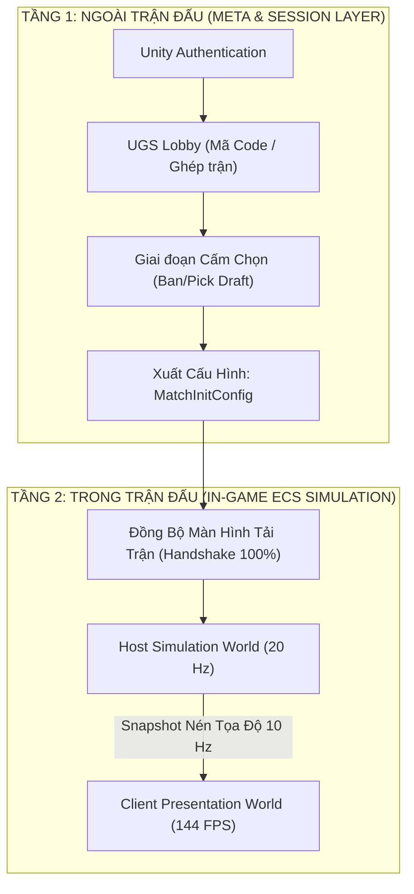

# Kiến Trúc Multiplayer Chuẩn Gaming & Lộ Trình Phát Triển

## Quyết định hiện hành — 2026-10-06

Server tạo map một lần và truyền dữ liệu kết quả cho client; client dựng map và xác nhận ready trước khi server bắt đầu trận. Multiplayer là giai đoạn triển khai tiếp theo. Xem [Server tạo map và đồng bộ tải trận](ServerMapLoading.md) cho trách nhiệm, protocol dự kiến và tiêu chí nghiệm thu. Quyết định này chưa được triển khai trong code.

MapGen Unity đã triển khai trong gameplay. Bắt đầu từ [mục lục các nhóm rule](../MapGeneration/MapGen_INDEX.md), sau đó mở phần tương ứng trong [file giải thích thuật toán](../MapGeneration/MapGen_Unity_Rules.md). Cách chạy Main và thay theme nằm trong [hướng dẫn gameplay](../MapGeneration/MapGen_Unity_ReadingGuide.md).

Lab và archive MapGen đã được xóa theo yêu cầu chủ project. Tra cứu bản Unity hiện hành qua mục lục và hướng dẫn gameplay ở trên.

Tài liệu này quy hoạch toàn bộ kiến trúc hạ tầng mạng, quy trình cấm chọn (Ban/Pick) và mô hình đồng bộ cho dự án RTS trên nền tảng **Unity DOTS ECS**.

---

## 🎯 1. Định Vị Mục Tiêu Kỹ Thuật

* **Mô hình máy chủ (Server Topology)**: **Host-Authoritative qua Unity Relay**.
  * 1 máy người chơi làm Host kiêm Server mô phỏng chân lý, 1 máy làm Client.
  * Kết nối thông qua **Unity Relay** (vượt tường lửa NAT Punchthrough 100% tự động, không tốn chi phí thuê máy chủ Cloud).
  * Chống gian lận (Anticheat) tuyệt đối: Server tính toán tầm nhìn, kẻ địch trong sương mù (Fog of War) không gửi dữ liệu về máy Client ➔ **Triệt tiêu hoàn toàn Map Hack**.
* **Quy mô trận đấu**: Hỗ trợ đại chiến **500 - 1,000+ đơn vị** cùng lúc nhờ nén lượng tử dữ liệu (Quantization) và tần số Snapshot thấp (10 - 12 Hz) kết hợp nội suy chuyển động (Interpolation 144 FPS).
* **Phòng chờ & Ghép trận**: Tích hợp **Unity Gaming Services (UGS Lobby + Authentication)**.
* **Hệ thống Cấm / Chọn (Draft)**: Hỗ trợ đa chế độ:
  * **Mode 1 - Blind Pick (Casual)**: Tự do chọn Civ trong phòng chờ, vào trận mới hé lộ.
  * **Mode 2 - Esports Ban/Pick (Ranked)**: Lượt cấm ➔ Lượt chọn có đồng hồ đếm ngược 30 giây và nút Khóa (Lock-in).

---

## 🗺️ 2. Sơ Đồ Kiến Trúc 2 Tầng (Separation of Concerns)

---

## 🚀 3. Lộ Trình Triển Khai 5 Sprint

> [!IMPORTANT]
> **Snapshot thứ tự triển khai (2026-09-27), đã được thay bởi quyết định 2026-10-06 ở đầu tài liệu:** Ưu tiên hoàn thành **Hạng mục B — MapGen, Data Texture và Player Spawn** theo [MapGen_ImplementationPlan.md](../MapGeneration/MapGen_ImplementationPlan.md). Công việc Sprint 0 về player identity, match contracts và match lifecycle được giữ trong backlog để thực hiện sau khi Hạng mục B được nghiệm thu. Bảng 5 Sprint bên dưới vẫn là lộ trình Multiplayer tổng thể.

| Sprint | Tên Giai Đoạn | Mục Tiêu Chính & Sản Phẩm Đầu Ra |
| :--- | :--- | :--- |
| **Sprint 0** | **Kiểm toán Hạ tầng Code & Chuẩn bị** | Xóa bỏ các điểm nghẽn code (`PlayerContextAuthoring` null trong build), thêm cờ đóng băng mô phỏng (`MatchPlayingTag`), định nghĩa `MatchDataContracts`. *(Chi tiết tại [Sprint0_CodeAudit.md](Sprint0_CodeAudit.md))* |
| **Sprint 1** | **Tích hợp UGS (Lobby & Relay)** | Đăng nhập ẩn danh, tạo phòng lấy mã 6 ký tự, nhập mã vào phòng chung qua Relay. |
| **Sprint 2** | **Xây dựng Hệ thống Ban/Pick (Draft)** | Giao diện phòng chờ cấm chọn, hỗ trợ Blind Pick và Turn-based Ban/Pick 30s. |
| **Sprint 3** | **Đồng bộ Loading & Khởi tạo Trận ECS** | Màn hình tải trận đồng bộ 2 bên 100%, nạp `MatchInitConfig` vào ECS để spawn nhà chính, nông dân theo đúng Civ. |
| **Sprint 4** | **Đồng bộ Gameplay & Tối ưu 1,000 Lính** | Đẩy `CommandQueue` qua mạng, cấu hình Ghost Snapshot, lọc sương mù chiến tranh (Fog of War Culling). |

---

## 📚 Danh Mục Tài Liệu Chi Tiết

* 📄 **[Sprint0_CodeAudit.md](Sprint0_CodeAudit.md)**: Báo cáo kiểm toán toàn diện mã nguồn hiện tại, danh sách lỗi kiến trúc và giải pháp chi tiết cho Sprint 0.
* 📄 **[MapGen_DataTexture_Specification.md](../MapGeneration/MapGen_DataTexture_Specification.md)**: Đặc tả kỹ thuật thuật toán sinh bản đồ theo mode, cân bằng bằng gói tài nguyên khởi đầu quanh mỗi base, mã hóa Texture RGBA, quy chuẩn chọn điểm Spawn và sinh thực thể vào ECS.
* 📄 **[MapGen_ImplementationPlan.md](../MapGeneration/MapGen_ImplementationPlan.md)**: Kế hoạch triển khai hiện hành, đã đối chiếu với source; bao gồm các ràng buộc Grid, Building Placement, prefab authoring và tiêu chí nghiệm thu.

