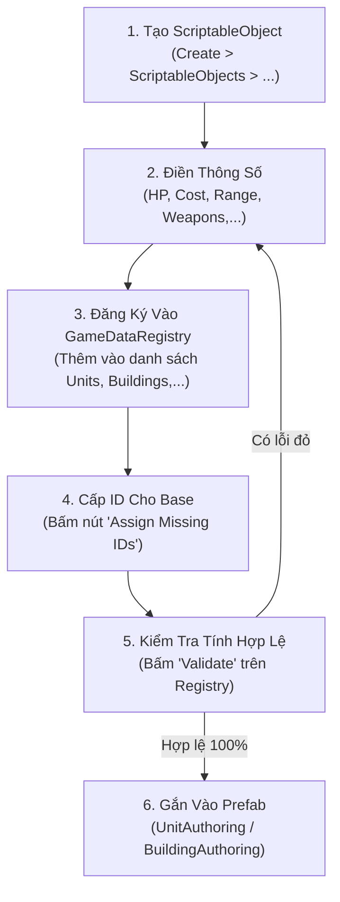

# Hướng Dẫn Thiết Kế & Cấu Hình Dữ Liệu RTS (Designer Portal)

Chào mừng bạn đến với tài liệu hướng dẫn dành cho **Game Designer** và **Content Creator** của dự án RTS. 

Toàn bộ hệ thống dữ liệu gameplay của dự án hiện đã được quy hoạch hoàn toàn vào kiến trúc **Game Data Registry & Blob Assets**, cho phép designer cấu hình linh hoạt thông qua ScriptableObject trên Unity Editor mà không cần can thiệp vào logic code của lập trình viên.

---

## 📚 Mục Lục Tài Liệu Cho Designer

| Tài Liệu | Mục Đích & Nội Dung Chính | Dành Cho Ai |
|---|---|---|
| [1. Hướng Dẫn Cấu Hình ScriptableObject & Quy Tắc ID](DataRefactor/DesignerSetup.md) | Cách tạo ScriptableObject, quy tắc đặt tên, cấp phát ID cho Base qua công cụ tự động, và chạy bộ kiểm tra dữ liệu (`Validate Selected Registry`). | Designer tạo đơn vị/nhà mới, cân bằng chỉ số. |
| [2. Cẩm Nang Tạo Asset & Thêm Kiểu Dữ Liệu](DataRefactor/DesignerTypeManual.md) | Hướng dẫn chi tiết từng bước: tạo Asset có sẵn (Attack, Gather, Build, Storage, Train, Research) và quy trình phối hợp với lập trình viên khi cần thêm một Ability hoàn toàn mới (ví dụ: Heal). | Designer & Gameplay Programmer. |
| [3. Hướng Dẫn Authoring Trên Prefab & Scene](DataRefactor/EntityAuthoring.md) | Cách gắn `UnitAuthoring` và `BuildingAuthoring` lên GameObject/Prefab, cấu hình máu ban đầu (`initialHealth`), tiến độ xây dựng (`initialConstructionProgress`). | Level Designer, Technical Artist, Prefab Authoring. |
| [4. Tham Khảo Cấu Trúc Blob Runtime](DataRefactor/BlobDefinitions.md) | Cấu trúc dữ liệu nhị phân (Blob) sau khi bake để lập trình viên tra cứu khi viết hoặc nâng cấp System. | Technical Designer, Programmer. |

---

## 🚀 Quy Trình Làm Việc Tiêu Chuẩn Cho Designer (Workflow)

### Các bước cụ thể:
1. **Tạo ScriptableObject:** 
   - Nhấp chuột phải trong cửa sổ Project: `Create → ScriptableObjects → ...` để tạo các file thông số (Ability, UnitSO, BuildingSO, BasedSO, Job, Tech).
2. **Đăng ký vào GameDataRegistry:**
   - Mở asset `Assets/Resources/GameReg.asset`.
   - Kéo asset vừa tạo vào đúng danh mục tương ứng (`Units`, `Buildings`, `Abilities`, `Jobs`, hoặc `Civs`).
3. **Cấp phát ID:**
   - Trên Inspector của `GameDataRegistry`, bấm nút **`Assign Missing IDs`** để hệ thống tự động cấp phát ID chuẩn định dạng cho các Base mới, sau đó bấm `Ctrl + S` (`Save Project`).
4. **Kiểm tra tính toàn vẹn (Validation):**
   - Bấm nút **`Validate`** trên Inspector của Registry (hoặc vào menu `Tools → Game Data → Validate Selected Registry`).
   - Sửa các cảnh báo/lỗi (nếu có) trước khi đưa vào gameplay.
5. **Gắn vào Prefab nhân vật / công trình:**
   - Mở Prefab của Unit hoặc Building.
   - Gắn `UnitAuthoring` (đối với lính) hoặc `BuildingAuthoring` (đối với nhà) và kéo thả SO định nghĩa tương ứng vào.

---

> [!TIP]
> **Mẹo hữu ích:** Luôn chạy công cụ **Validate** trước khi test Play Mode để đảm bảo không có liên kết nào bị null hoặc ID bị trùng lặp.
