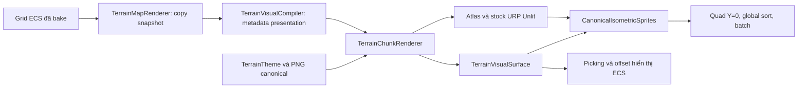

# 01 — Phạm vi, hợp đồng và kiến trúc

## 1. Bài toán và ranh giới

Đầu vào là topology đã quyết định. Visualizer cần làm rõ mặt ngang, ramp, cliff và cụm núi bằng artwork isometric, đồng thời giữ grid gameplay phẳng. Nó không được tự thêm ô núi, sửa cost, đổi vị trí resource hay tìm đường.

| Chủ thể | Sở hữu quyết định | Visualizer sử dụng |
|---|---|---|
| MapGen/bake | Kích thước, origin, cellsize, heightLevel, CornerMask, mountain/ramp, walkable | Snapshot đọc từ ECS |
| Resource planner | Quota, footprint và tránh chân/đỉnh ramp | Chỉ hiển thị đối tượng đã đặt |
| Navigation/physics | Cost, collider, transform logic | Không lấy silhouette PNG để suy ra blockage |
| Terrain Visualizer | Artwork, camera chuẩn, projection, mask hiển thị, atlas, face order, picking | Tạo dữ liệu và tài nguyên presentation |

Quy tắc resource không spawn ở chân/đỉnh ramp là hợp đồng phía planner; lab tích hợp kiểm tra footprint và một ô margin. Decor của visualizer có quy tắc riêng: không thêm accent gần ramp trong cửa sổ 7×7. Decor không phải resource node.

## 2. Hợp đồng đầu vào

`TerrainMapRenderer` đợi Default World, singleton `GridComponent`/buffer `GridTerrain`, buffer có đúng `width*height` phần tử và `Camera.main`. Nó sao chép grid vào `GeneratedTerrain`; nếu có `GridSpawnCell` thì sao chép spawn để loại decor quanh spawn. Không gọi generator để tạo bản đồ thứ hai.

Điều kiện của dữ liệu chuẩn: cellsize dương, width/height hợp lệ, chỉ số cell theo `z*width+x`, các corner của ô có span không quá một tầng khi chọn top sprite. Bản adapter hiện chỉ kiểm tra một phần các điều kiện này; không nhận nó là validator đầy đủ cho dữ liệu ngoài project.

`TerrainVisualCompiler` viết lại `map.draws` trên snapshot. Nếu snapshot dùng shared corners, compiler bỏ qua draw metadata vì corner mask đã bake. Với terrace topology, nó tìm đúng mặt nối low/high và metadata hướng ramp. Sự tồn tại của nhánh tương thích input này không đồng nghĩa runtime giữ thuật toán offset cũ đã xóa.

## 3. Luồng xử lý

## 4. Thành phần và ownership

| Thành phần | Trách nhiệm | Vòng đời / tài nguyên |
|---|---|---|
| [TerrainMapRenderer](../../Assets/_Project/Scripts/Runtime/Simulation/MapGeneration/TerrainMapRenderer.cs) | Adapter grid → snapshot, configure camera, build một lần | Disable/Destroy gọi Clear; không theo dõi thay đổi topology liên tục |
| [TerrainTheme](../../Assets/_Project/Scripts/Runtime/Simulation/MapGeneration/TerrainTheme.cs) | Slot PNG, seed visual, metrics, sampling | ScriptableObject được tham chiếu; renderer không sở hữu PNG nguồn |
| [TerrainVisualCompiler](../../Assets/_Project/Scripts/Runtime/Simulation/MapGeneration/TerrainVisualCompiler.cs) | Metadata draw cho input terrace | Không sửa ECS buffer gốc |
| [TerrainVisualSurface](../../Assets/_Project/Scripts/Runtime/Presentation/Terrain/TerrainVisualSurface.cs) | Hàm độ cao ảo, raycast, Active surface | Managed snapshot; không tạo collider |
| [TerrainChunkRenderer](../../Assets/_Project/Scripts/Runtime/Presentation/Terrain/TerrainChunkRenderer.cs) | Pack atlas, material, build/clear | Sở hữu atlas, material, meshes và root sinh ra |
| [CanonicalIsometricSprites](../../Assets/_Project/Scripts/Runtime/Presentation/Terrain/CanonicalIsometricSprites.cs) | Chọn face, projection, sort toàn map, emit mesh | Đưa mesh vào danh sách do renderer sở hữu |
| [MountainVisualField](../../Assets/_Project/Scripts/Runtime/Presentation/Terrain/MountainVisualField.cs) | Trường khoảng cách đỉnh chung | Mảng tạm khi build, không ghi gameplay |
| [IsometricTerrainCamera](../../Assets/_Project/Scripts/Runtime/Presentation/Camera/IsometricTerrainCamera.cs) | Orthographic 30°/45°, pan/zoom theo hệ thống camera | ExecuteAlways; thay angle cần sửa cả hợp đồng art |
| [Offset](../../Assets/_Project/Scripts/Runtime/Presentation/Terrain/TerrainVisualOffsetSystem.cs) / [Restore](../../Assets/_Project/Scripts/Runtime/Presentation/Terrain/TerrainVisualRestoreSystem.cs) | LocalToWorld hiển thị ↔ ma trận logic | Dictionary theo Entity, restore trước simulation |

`Clear` deactive surface, tắt root trước khi Destroy trì hoãn trong Play, giải phóng từng mesh/material/atlas và bỏ tham chiếu view. Edit mode dùng DestroyImmediate. PNG source và theme không bị hủy.

## 5. Invariant và lỗi hợp đồng

1. Vertex terrain local/world Y=0; root không được đặt transform khiến invariant sai.
2. Visualizer không ghi `LocalTransform`, navigation cost hoặc collider từ artwork.
3. Một top/cap chỉ biểu diễn chênh lệch corner tối đa một tầng.
4. Canvas canonical, pivot và camera phải đồng bộ; không crop ảnh rồi mong renderer tự sửa.
5. Theme lỗi, camera lỗi hoặc atlas bị scale phải fail rõ; adapter Clear và disable thay vì tạo terrain nửa hoàn chỉnh.

Các invariant 1–4 có test tương ứng tại [lab](06_Lab_BangChung.md). Multi-world, nhiều camera độc lập, streaming và rebuild gia tăng chưa nằm trong hợp đồng hiện hành.
