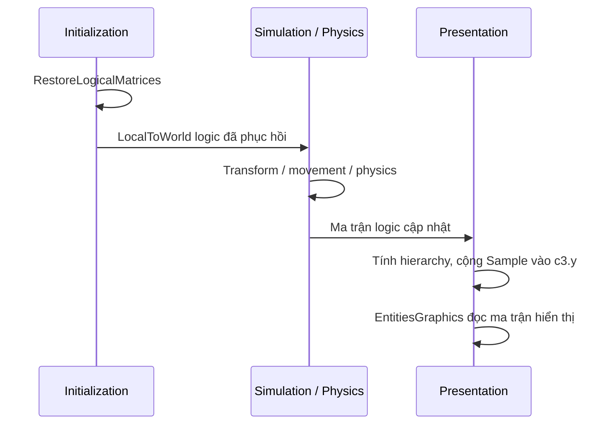

# 04 — Surface ảo, picking và vòng đời ECS

## 1. Surface là mô hình presentation

`TerrainVisualSurface` giữ snapshot `GeneratedTerrain`, rise, minimum heightLevel và hướng ramp tương thích metadata. `Sample(worldX,worldZ)` đổi sang tọa độ grid bằng origin/cellsize, trả 0 nếu ngoài bounds, rồi nội suy mặt trong ô. Trong shared-corner mode dùng hai tam giác; trong terrace mode nội suy tuyến tính giữa mức low/high theo hướng ramp.

`minimum` làm mốc cao độ hiển thị. Nó không sửa heightLevel gốc. Surface không đưa mountain BFS cap vào hàm Sample: đá cap là lớp trang trí trên ô mountain đã blocked; mặt lấy để picking/offset là mặt terrain cơ sở. Vì vậy click đúng silhouette đá nổi không được mặc nhiên xem là raycast vào một mô hình núi 3D chính xác.

`Active` hiện là một static surface cho scene/default-world presentation. SubsystemRegistration reset nó đầu phiên Play; renderer Activate/Deactivate theo lifecycle. Multi-camera, nhiều surface/world đồng thời cần một registry hoặc ownership rõ hơn; chưa có trong triển khai này.

## 2. Raycast trên mặt ảo

Raycast không dùng collider terrain. Nó:

1. Cắt ray với bounds X/Z bằng slab để tìm khoảng enter/exit.
2. Tìm ô đầu tiên và bước DDA theo các giao cắt biên X/Z tiếp theo.
3. Tạo bốn corner ảo từ CellHeight của ô đang đi qua.
4. Test ray với hai triangle 00–11–10 và 00–01–11, chọn hit gần nhất hợp lệ trong khoảng đang xét.
5. Trả `visible=(x,h,z)` và `logical=(x,0,z)`.

Giới hạn mặc định maxDistance=1000; số bước chặn ở width+height+4. Với ray gần song song trục, khoảng sang ô tiếp theo là infinity. Chi phí chủ yếu phụ thuộc số ô ray chạm, không cần test mọi cell. Đây là mô hình top surface, không phải collider cho tất cả wall hoặc alpha pixel.

`CameraScript`, `MouseWorldPosition`, `BuildingPlacer` và selection sử dụng logical point để giữ lệnh gameplay trên grid phẳng. Một số caller sử dụng `LogicalRay`, tức dịch origin ray theo visible height; cần test riêng caller này, không coi nó tương đương đầy đủ với việc trả logical point trong mọi góc ray.

## 3. Offset và restore

Offset query chọn LocalToWorld + MaterialMeshInfo và loại DisableRendering. System chỉ chạy cho Default World. Nó giữ hai dictionary: `baseline` là ma trận logic, `displayed` là ma trận đã ghi để hiển thị. Khi frame trước vẫn còn đúng displayed matrix, baseline có thể dùng làm fallback cho entity thiếu hierarchy đầy đủ.

`TryLogicalMatrix` hiện duyệt leaf→root tối đa 64 lần. Mỗi node lấy LocalTransform.ToMatrix, nhân PostTransformMatrix nếu có, rồi nhân bên trái vào kết quả. Parent thiếu, LocalTransform thiếu hoặc cycle quá giới hạn trả false; dùng fallback có sẵn thay vì gọi helper duyệt không giới hạn. Không ghi LocalTransform.

Restore chỉ ghi baseline nếu entity còn tồn tại, còn LocalToWorld, và current matrix bằng chính displayed matrix lần trước. Điều kiện bằng nhau tránh ghi đè một ma trận đã được hệ thống khác thay đổi. Restore hoàn tất dependency LocalToWorld vì được gọi từ Initialization system khác. OnUpdate dùng dependency của SystemBase và đăng ký lookup; không giữ các lệnh complete thừa đã bỏ trong điều tra lỗi.

Cache loại entity chết mỗi 120 update; Clear cache khi surface tắt. Dictionary và việc tính hierarchy nằm trên main thread; chi phí tăng theo số render entity × độ sâu hierarchy. Chưa có chứng cứ cache tăng không giới hạn trong phiên dài, cũng chưa có benchmark cho hàng nghìn quân động.

## 4. Điều tra NullReferenceException ngày 2026-10-10

**Đã xác nhận:** DLL/PDB cũ map IL offset `0x128` / line 41 tới `baseline[entity] = original`. Sampling độ cao nằm sau đó. `EnsureCaches` đã chạy trước vòng lặp. Log cùng phiên còn có entity không hợp lệ và Parent lookup lỗi.

**Chưa xác định:** tại sao trạng thái trở nên không hợp lệ. Không đủ dữ liệu để kết luận do terrain height, cache null sau reload, thiếu job completion, Unity helper hoặc Burst memory corruption. Người dùng cũng không tái hiện được lỗi.

Lab cũ thử Burst bật/tắt và thuật toán cũ 786.432 lượt chưa tái hiện; theo yêu cầu người dùng, source lab/probe và command đã xóa. Chỉ giữ báo cáo lịch sử [điều tra](../../Artifacts/TerrainVisual/History/offset-cause-investigation.md) và [IL](../../Artifacts/TerrainVisual/History/offset-original-il.txt). Không hướng dẫn chạy lại command `offset-cause`.

Kiểm thử hiện hành là `Validate Terrain Offset Reload Recovery`, gồm cache absent, offset/restore, entity destruction, hierarchy 20 parent + scale và cycle. Test này không phải chứng minh nguồn gốc lỗi hoặc tái hiện thật hot reload trong một phiên gameplay dài.

## 5. Fixture cần có khi mở rộng

Thêm/diệt unit trong Play, tháo parent, disable surface, đổi scene, Play/Stop với domain reload tắt, sửa script trong Play, camera click ngoài map và ray sát cạnh. Ghi world/entity/frame/phase trước khi diễn giải nguyên nhân; giữ stack gốc, không nuốt exception để tạo một lần chạy “PASS”.
