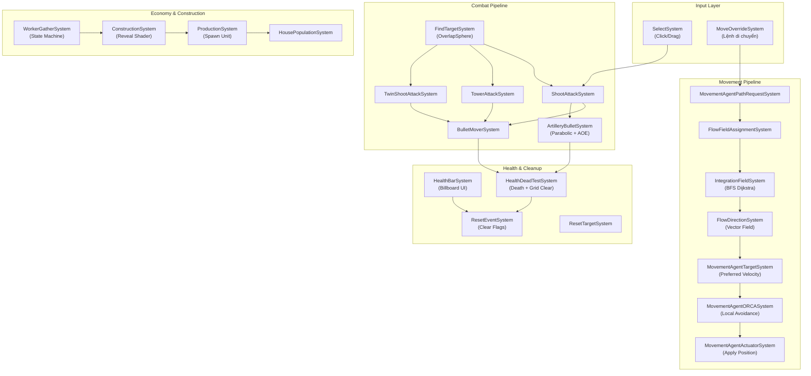

# 📋 BẢN NHẬN XÉT & KIẾN NGHỊ — DỰ ÁN RTS (DOTS/ECS)
### Phiên bản 2 — Dựa trên đọc trực tiếp toàn bộ ~70 file source code

> [!NOTE]
> Bản nhận xét này được xây dựng bằng cách **đọc từng dòng code** của toàn bộ file `.cs` và `.shadergraph` trong thư mục `Assets/Scripts/`, KHÔNG dựa vào bản nhận xét trước. Tổng cộng **~70 file** đã được phân tích.

---

## MỤC LỤC

1. [Tổng quan kiến trúc](#1-tổng-quan-kiến-trúc)
2. [Phân loại hệ thống chi tiết](#2-phân-loại-hệ-thống-chi-tiết)
3. [Các BUG nghiêm trọng phát hiện được](#3-các-bug-nghiêm-trọng-phát-hiện-được)
4. [Các vấn đề Performance](#4-các-vấn-đề-performance)
5. [Các vấn đề Code Quality](#5-các-vấn-đề-code-quality)
6. [Kiến nghị SỬA ĐỔI (Fix)](#6-kiến-nghị-sửa-đổi)
7. [Kiến nghị THÊM MỚI (New Feature/System)](#7-kiến-nghị-thêm-mới)
8. [Bảng tổng hợp ưu tiên](#8-bảng-tổng-hợp-ưu-tiên)

---

## 1. Tổng quan kiến trúc

Project sử dụng **Unity DOTS (Data-Oriented Technology Stack)** với kiến trúc **ECS (Entity Component System)**. Toàn bộ logic gameplay được viết bằng `ISystem` (unmanaged system), `IComponentData`, `IBufferElementData`, và `IJobEntity`.



**Tổng số file code game (không tính thư viện bên thứ 3):** ~70 file
- **Movement & FlowField:** ~39 file (chiếm phần lớn nhất, hệ thống phức tạp nhất)
- **Combat:** 8 file
- **Economy/Construction/Production:** 4 file
- **PlayerContext:** 4 file
- **Select:** 5 file
- **Authoring/Component (CoreECS):** ~25+ file
- **Misc/Helper:** ~5 file
- **Shader:** 1 file (BuildingRevealShaderGraph.shadergraph)

---

## 2. Phân loại hệ thống chi tiết

### 2.1. 🟢 Hệ thống Di chuyển — FlowField Navigation (Chất lượng: TỐT)

Đây là hệ thống **hoàn thiện nhất** trong project, sử dụng kiến trúc Multi-Seed Connected Region Partitioning (CRP) rất tiên tiến.

| File | Chức năng thực tế | Đánh giá |
|------|-------------------|----------|
| [GridAuthoring.cs](file:///d:/Unity/TechTextAndChosingForRTS%20sample/Assets/Scripts/Game(New%20Simulation%20Logic)/MovementAgent/Grid/GridAuthoring.cs) | Bake Grid từ Renderer bounds (64/128/256) | ⚠️ Có `using UnityEditor` — **sẽ lỗi khi Build Player** |
| [GridComponent.cs](file:///d:/Unity/TechTextAndChosingForRTS%20sample/Assets/Scripts/Game(New%20Simulation%20Logic)/MovementAgent/Grid/GridComponent.cs) | Định nghĩa GridComponent, GridNodeCost, GridIsland | ✅ Chuẩn |
| [GridInitSystem.cs](file:///d:/Unity/TechTextAndChosingForRTS%20sample/Assets/Scripts/Game(New%20Simulation%20Logic)/MovementAgent/Grid/GridInitSystem.cs) | Khởi tạo buffer cost=1, island=0, clone PhysicsCollider | ⚠️ Có `using static` thừa |
| [CostChangeComponent.cs](file:///d:/Unity/TechTextAndChosingForRTS%20sample/Assets/Scripts/Game(New%20Simulation%20Logic)/MovementAgent/Grid/Cost/CostChangeComponent.cs) | Buffer CostChangeRequest (newCost + area rect) | ✅ Gọn gàng |
| [CostChangeSystem.cs](file:///d:/Unity/TechTextAndChosingForRTS%20sample/Assets/Scripts/Game(New%20Simulation%20Logic)/MovementAgent/Grid/Cost/CostChangeSystem.cs) | Áp dụng cost change + **Heartbeat 12 ticks** rate-limiting | ✅ Thiết kế thông minh |
| [GridIslandSystem.cs](file:///d:/Unity/TechTextAndChosingForRTS%20sample/Assets/Scripts/Game(New%20Simulation%20Logic)/MovementAgent/Grid/Cost/GridIslandSystem.cs) | BFS Flood-fill 8 hướng phân vùng Island, chống cắt góc | ⚠️ Main Thread, spike khi map 256² |
| [IntegrationFieldSystem.cs](file:///d:/Unity/TechTextAndChosingForRTS%20sample/Assets/Scripts/Game(New%20Simulation%20Logic)/MovementAgent/Field/IntegrationField/IntegrationFieldSystem.cs) | Dijkstra/BFS 8 hướng multi-seed CRP, chi phí thẳng 10 chéo 14 | ✅ IJobChunk + Burst |
| [FlowDirectionSystem.cs](file:///d:/Unity/TechTextAndChosingForRTS%20sample/Assets/Scripts/Game(New%20Simulation%20Logic)/MovementAgent/Field/FlowField/FlowDirectionSystem.cs) | Tính vector hướng từ integration field | ✅ IJobChunk + Burst |
| [FlowFieldInvalidationSystem.cs](file:///d:/Unity/TechTextAndChosingForRTS%20sample/Assets/Scripts/Game(New%20Simulation%20Logic)/MovementAgent/Field/FlowField/FlowFieldInvalidationSystem.cs) | Phát hiện FlowField lỗi thời, throttle recalc theo refCount | ✅ Thiết kế xuất sắc |
| [FlowFieldCacheHelper.cs](file:///d:/Unity/TechTextAndChosingForRTS%20sample/Assets/Scripts/Game(New%20Simulation%20Logic)/MovementAgent/Helpers/FlowFieldCacheHelper.cs) | LRU Cache tối đa 160 FlowField | ✅ |
| [FlowFieldCleanUp.cs](file:///d:/Unity/TechTextAndChosingForRTS%20sample/Assets/Scripts/Game(New%20Simulation%20Logic)/MovementAgent/Field/FlowFieldCache/FlowFieldCleanUp.cs) | Dọn FlowField refCount ≤ 0 và không nằm trong cache | ✅ |
| [MovementAgentORCASystem.cs](file:///d:/Unity/TechTextAndChosingForRTS%20sample/Assets/Scripts/Game(New%20Simulation%20Logic)/MovementAgent/LocalAvoidance/Avoidance/MovementAgentORCASystem.cs) | **ORCA** — Optimal Reciprocal Collision Avoidance, LP2+LP3, 25 neighbors/6m, Grid Gradient | ✅ IJobEntity + Burst. Rất mạnh |
| [MovementAgentActuatorSystem.cs](file:///d:/Unity/TechTextAndChosingForRTS%20sample/Assets/Scripts/Game(New%20Simulation%20Logic)/MovementAgent/LocalAvoidance/Actuation/MovementAgentActuatorSystem.cs) | Apply velocity + Stuck Detection (ngưỡng thích ứng 0.25s/1s/2s) + Safety Net overlap correction | ✅ IJobEntity + Burst |
| [MovementAgentTargetSystem.cs](file:///d:/Unity/TechTextAndChosingForRTS%20sample/Assets/Scripts/Game(New%20Simulation%20Logic)/MovementAgent/LocalAvoidance/Targeting/MovementAgentTargetSystem.cs) | Tính preferredVelocity: Island Sync → Slot Blend → Arrival Damping | ✅ IJobEntity + Burst |
| [MovementAgentGroupFormationSystem.cs](file:///d:/Unity/TechTextAndChosingForRTS%20sample/Assets/Scripts/Game(New%20Simulation%20Logic)/MovementAgent/LocalAvoidance/Formating/MovementAgentGroupFormationSystem.cs) | Gom nhóm theo Island, phân slot Box/Circle Formation | ⚠️ O(N²) khi spam click 100+ lính |
| [MovementAgentAvoidanceSystem.cs](file:///d:/Unity/TechTextAndChosingForRTS%20sample/Assets/Scripts/Game(New%20Simulation%20Logic)/MovementAgent/LocalAvoidance/Avoidance/MovementAgentAvoidanceSystem.cs) | Context Steering 16 tia (ĐÃ BỊ TẮT — `[DisableAutoCreation]`) | ℹ️ Giữ lại tham khảo |
| [MovementAgentAPI.cs](file:///d:/Unity/TechTextAndChosingForRTS%20sample/Assets/Scripts/Game(New%20Simulation%20Logic)/MovementAgent/CommandBridge/API/MovementAgentAPI.cs) | API tĩnh: SetTarget, ClearTarget, StopAgent | 🔴 **Bug: StopAgent không release FlowField refCount** |
| [FlowFieldAssignmentSystem.cs](file:///d:/Unity/TechTextAndChosingForRTS%20sample/Assets/Scripts/Game(New%20Simulation%20Logic)/MovementAgent/CommandBridge/FlowFieldAssignmentSystem.cs) | Gán FlowField cho agent từ cache hoặc tạo mới | 🔴 O(N×M) query lồng, thiếu Burst, Sync Point |
| [MovementAgentPathRequestSystem.cs](file:///d:/Unity/TechTextAndChosingForRTS%20sample/Assets/Scripts/Game(New%20Simulation%20Logic)/MovementAgent/CommandBridge/MovementAgentPathRequestSystem.cs) | Phát hiện agent cần FlowField mới → thêm TargetChangeRequest | 🔴 `Complete()` + `Playback()` cưỡng bức mỗi frame |
| [MovementAgentAuthoring.cs](file:///d:/Unity/TechTextAndChosingForRTS%20sample/Assets/Scripts/Game(New%20Simulation%20Logic)/MovementAgent/AgentMovementData/MovementAgentAuthoring.cs) | Bake agent data + Context Steering buffers | 🔴 **`using UnityEditor.ShaderGraph.Internal` — lỗi Build Player** |
| [SetupUnitDefaultPositionSystem.cs](file:///d:/Unity/TechTextAndChosingForRTS%20sample/Assets/Scripts/Game(New%20Simulation%20Logic)/Movement/SetupUnitDefaultPositionSystem.cs) | Set target = current position cho unit vừa spawn | 🔴 **Tạo FlowField riêng cho MỖI unit spawn → tràn cache 160** |

---

### 2.2. 🔴 Hệ thống Chiến đấu — Combat (Chất lượng: CẦN SỬA NHIỀU)

| File | Chức năng thực tế | Đánh giá |
|------|-------------------|----------|
| [FindTargetSystem.cs](file:///d:/Unity/TechTextAndChosingForRTS%20sample/Assets/Scripts/Game(New%20Simulation%20Logic)/System/Combat/FindTargetSystem.cs) | Quét OverlapSphere theo timer, lọc layer Units+Building, tìm gần nhất | ⚠️ playerID cứng 2 phe, thiếu health>0 check, lag spike đồng bộ timer |
| [ShootAttackSystem.cs](file:///d:/Unity/TechTextAndChosingForRTS%20sample/Assets/Scripts/Game(New%20Simulation%20Logic)/System/Combat/ShootAttackSystem.cs) | Chase → Stop → Yaw Aim (dot≥0.95) → Spawn đạn từ WeaponSlot buffer. Hỗ trợ micro hit-and-run | 🔴 Bắn xác chết, spam SetTarget mỗi frame, không Burst |
| [TowerAttackSystem.cs](file:///d:/Unity/TechTextAndChosingForRTS%20sample/Assets/Scripts/Game(New%20Simulation%20Logic)/System/Combat/TowerAttackSystem.cs) | Tháp cố định: check UnderConstruction → Aim (dot≥0.98) → Spawn đạn từ WeaponSlot | 🔴🔴 **`EntityManager.Instantiate` TRONG VÒNG LẶP QUERY** — Hard Sync Point |
| [TwinShootAttackSystem.cs](file:///d:/Unity/TechTextAndChosingForRTS%20sample/Assets/Scripts/Game(New%20Simulation%20Logic)/System/Combat/TwinShootAttackSystem.cs) | Tháp đôi 2 nòng: tương tự Tower nhưng spawn 2 đạn/lượt | 🔴🔴 Cùng anti-pattern, thiếu check Health, thiếu check UnderConstruction |
| [BulletMoverSystem.cs](file:///d:/Unity/TechTextAndChosingForRTS%20sample/Assets/Scripts/Game(New%20Simulation%20Logic)/System/Combat/BulletMoverSystem.cs) | Bay thẳng homing, hỗ trợ ShootVictim hit offset, overshoot prevention, va chạm ≤0.2m | ⚠️ Nguy cơ NaN từ `math.normalize`, thiếu Burst trên struct |
| [ArtilleryBulletMoverSystem.cs](file:///d:/Unity/TechTextAndChosingForRTS%20sample/Assets/Scripts/Game(New%20Simulation%20Logic)/System/Combat/ArtilleryBulletMoverSystem.cs) | Parabol 3D (4h×t×(1-t)), nổ AOE tạo ExplosionEvent, trừ máu diện rộng | 🔴 AOE quét O(M×N) toàn map, bỏ sót Building |
| [HealthBarSystem.cs](file:///d:/Unity/TechTextAndChosingForRTS%20sample/Assets/Scripts/Game(New%20Simulation%20Logic)/System/Combat/HealthBarSystem.cs) | Billboard xoay theo Camera, scale bar theo tỉ lệ HP, dùng PostTransformMatrix | 🔴 Dùng `Camera.main` (không Burst), thiếu `Exists` check, lỗi chính tả |
| [HealthDeadTestSystem.cs](file:///d:/Unity/TechTextAndChosingForRTS%20sample/Assets/Scripts/Game(New%20Simulation%20Logic)/System/Combat/HealthDeadTestSystem.cs) | Death: tìm root entity → giảm population → gửi CostChangeRequest clear grid → hủy LinkedEntityGroup | 🔴 `CreateEntityQuery` TRONG VÒNG LẶP, component BuildingCostArea đặt sai file |

---

### 2.3. 🟡 Hệ thống Kinh tế & Xây dựng (Chất lượng: TRUNG BÌNH)

| File | Chức năng thực tế | Đánh giá |
|------|-------------------|----------|
| [ConstructionSystem.cs](file:///d:/Unity/TechTextAndChosingForRTS%20sample/Assets/Scripts/Game(New%20Simulation%20Logic)/System/Construction/ConstructionSystem.cs) | Lerp RevealHeight từ Start→End theo progress, áp lên root + LinkedEntityGroup con, xóa tag khi xong | ✅ Burst, nhưng code bị lặp 2 lần |
| [HousePopulationSystem.cs](file:///d:/Unity/TechTextAndChosingForRTS%20sample/Assets/Scripts/Game(New%20Simulation%20Logic)/System/Construction/HousePopulationSystem.cs) | 2 System: cộng maxPop khi nhà xây xong + trừ maxPop khi nhà bị phá (ICleanupComponentData) | 🔴 PlayerContextHelper tạo query + ToEntityArray mỗi lần gọi |
| [ProductionSystem.cs](file:///d:/Unity/TechTextAndChosingForRTS%20sample/Assets/Scripts/Game(New%20Simulation%20Logic)/System/Construction/ProductionSystem.cs) | Đếm ngược → spawn unit từ queue → check dân số → gán MoveOverride rally point | 🔴 Debug.Log trong Burst, thiếu trừ tài nguyên, lỗi chính tả `untiComponent` |
| [WorkerGatherSystem.cs](file:///d:/Unity/TechTextAndChosingForRTS%20sample/Assets/Scripts/Game(New%20Simulation%20Logic)/System/Economy/WorkerGatherSystem.cs) | State Machine 3 pha: GoingToNode → Gathering → ReturningDepot, auto-find nearest depot | 🔴🔴 **Hàng chục `Debug.Log` mỗi frame**, Singleton PlayerResourceData dùng chung mọi player, O(N×M) find depot |

---

### 2.4. 🔴 Hệ thống PlayerContext (Chất lượng: KÉM)

| File | Chức năng thực tế | Đánh giá |
|------|-------------------|----------|
| [PlayerContext.cs](file:///d:/Unity/TechTextAndChosingForRTS%20sample/Assets/Scripts/Game(New%20Simulation%20Logic)/System/PlayerContext/PlayerContext.cs) | Định nghĩa PlayerContext, ResourcePair, PlayerContextHelper (Get/Create/Update/Delete) | 🔴 Boxing `object value`, CreateEntityQuery mỗi lần gọi, bug DeletePlayerContext |
| [PlayerContextSyncSystem.cs](file:///d:/Unity/TechTextAndChosingForRTS%20sample/Assets/Scripts/Game(New%20Simulation%20Logic)/System/PlayerContext/PlayerContextSyncSystem.cs) | Đồng bộ ResourceData→ResourcePair + bắn EventBus UI | 🔴🔴 **`Resources.Load` MỖI FRAME**, bug struct copy không gán lại buffer → event bắn liên tục |

---

### 2.5. 🟢 Hệ thống Lựa chọn — Select (Chất lượng: TỐT)

| File | Chức năng thực tế | Đánh giá |
|------|-------------------|----------|
| [SelectSystem.cs](file:///d:/Unity/TechTextAndChosingForRTS%20sample/Assets/Scripts/Game(New%20Simulation%20Logic)/System/SelectSystem/SelectSystem.cs) | Click=Raycast, Drag=Trapezoid + SpatialGrid. Dùng NativeParallelMultiHashMap | ✅ Thiết kế xuất sắc, thiếu Add/Remove/Clear mode |
| [SelectTags.cs](file:///d:/Unity/TechTextAndChosingForRTS%20sample/Assets/Scripts/Game(New%20Simulation%20Logic)/System/SelectSystem/SelectTags.cs) | Selectable, Selected (IEnableableComponent), SelectableBucketContainer | ✅ Best practice DOTS |
| [SelecUISystem.cs](file:///d:/Unity/TechTextAndChosingForRTS%20sample/Assets/Scripts/Game(New%20Simulation%20Logic)/System/SelectSystem/SelecUISystem.cs) | Bật/tắt SpriteRenderer theo Selected state | ⚠️ Lỗi chính tả tên file, Managed object access |

---

### 2.6. 🟢 Hệ thống Phụ trợ (Chất lượng: TỐT)

| File | Chức năng thực tế | Đánh giá |
|------|-------------------|----------|
| [MatchTime.cs](file:///d:/Unity/TechTextAndChosingForRTS%20sample/Assets/Scripts/Game(New%20Simulation%20Logic)/Misc/MatchTime.cs) | Singleton đếm thời gian trận, FixedStep | ✅ Chuẩn mực |
| [ResetEventSystem.cs](file:///d:/Unity/TechTextAndChosingForRTS%20sample/Assets/Scripts/Game(New%20Simulation%20Logic)/System/ResetSystem/ResetEventSystem.cs) | Reset `OnHealthChanged = false` cuối frame (OrderLast) | ✅ |
| [ResetTargetSystem.cs](file:///d:/Unity/TechTextAndChosingForRTS%20sample/Assets/Scripts/Game(New%20Simulation%20Logic)/System/ResetSystem/ResetTargetSystem.cs) | Null hóa Target nếu entity chết hoặc ra khỏi tầm | ✅ Burst |
| [ORCAMath.cs](file:///d:/Unity/TechTextAndChosingForRTS%20sample/Assets/Scripts/Game(New%20Simulation%20Logic)/MovementAgent/Helpers/ORCAMath.cs) | Toán ORCA: CreateAgentLine, LP2, LP3 | ✅ |
| [GridHelper.cs](file:///d:/Unity/TechTextAndChosingForRTS%20sample/Assets/Scripts/Game(New%20Simulation%20Logic)/MovementAgent/Helpers/GridHelper.cs) | WorldToGrid, GridToWorld, GetNodeIndex, BoundsCheck | ✅ |
| [Faction.cs](file:///d:/Unity/TechTextAndChosingForRTS%20sample/Assets/Scripts/Faction.cs) | Enum phe: Player1, Player2 | ✅ |
| [ResourceType.cs](file:///d:/Unity/TechTextAndChosingForRTS%20sample/Assets/Scripts/Game(New%20Simulation%20Logic)/System/ResourceSystem/ResourceType.cs) | Enum: Gold, Wood, Food | ✅ |
| [BuildingRevealShaderGraph.shadergraph](file:///d:/Unity/TechTextAndChosingForRTS%20sample/Assets/Materials/BuildingRevealShaderGraph.shadergraph) | Shader hiệu ứng reveal nhà khi xây, điều khiển bởi `RevealHeightProperty` từ ConstructionSystem | ✅ |

---

## 3. Các BUG nghiêm trọng phát hiện được

### 🔴 BUG #1 — `TowerAttackSystem` & `TwinShootAttackSystem`: EntityManager.Instantiate trong Query Loop

> [!CAUTION]
> Đây là **lỗi nghiêm trọng nhất** trong project. Gọi `state.EntityManager.Instantiate()` trực tiếp bên trong vòng lặp `SystemAPI.Query` sẽ gây ra **Hard Sync Point**, phá hủy hoàn toàn Chunk Iterator đang chạy, invalidate cache và block toàn bộ Job System.

**File:** [TowerAttackSystem.cs](file:///d:/Unity/TechTextAndChosingForRTS%20sample/Assets/Scripts/Game(New%20Simulation%20Logic)/System/Combat/TowerAttackSystem.cs), [TwinShootAttackSystem.cs](file:///d:/Unity/TechTextAndChosingForRTS%20sample/Assets/Scripts/Game(New%20Simulation%20Logic)/System/Combat/TwinShootAttackSystem.cs)

---

### 🔴 BUG #2 — `PlayerContextSyncSystem`: Resources.Load mỗi frame + Buffer không update

**File:** [PlayerContextSyncSystem.cs](file:///d:/Unity/TechTextAndChosingForRTS%20sample/Assets/Scripts/Game(New%20Simulation%20Logic)/System/PlayerContext/PlayerContextSyncSystem.cs)

2 lỗi chồng chất:
1. `Resources.Load<EventBus>("EventBus")` gọi **MỖI FRAME** trong `OnUpdate` → tìm kiếm disk I/O liên tục
2. `var cache = contextcache[i]` tạo bản sao struct, sửa xong nhưng **KHÔNG gán lại** `contextcache[i] = cache` → dữ liệu cache không bao giờ update → event UI bắn liên tục mỗi frame

---

### 💡 TIP #3 — `StopAgent` vs `ClearTarget`: 2 hàm có mục đích khác nhau

**File:** [MovementAgentAPI.cs](file:///d:/Unity/TechTextAndChosingForRTS%20sample/Assets/Scripts/Game(New%20Simulation%20Logic)/MovementAgent/CommandBridge/API/MovementAgentAPI.cs)

> [!TIP]
> Đây **KHÔNG phải bug** mà là thiết kế có chủ đích:
> - **`ClearTarget`** (dòng 41): Dừng hoàn toàn + **giải phóng FlowField** (`ReleaseFieldFromMoveComponent`) → Dùng khi unit bị huỷ hoặc mất mục tiêu vĩnh viễn.
> - **`StopAgent`** (dòng 59): Dừng tạm thời + **giữ lại FlowField** → Dùng khi unit dừng để bắn, sau đó có thể resume di chuyển mà không cần tính lại FlowField mới.
>
> **Lưu ý cho dev:** Khi gọi hàm dừng, cần chọn đúng hàm theo ngữ cảnh. Nếu gọi nhầm `StopAgent` khi thực sự cần `ClearTarget`, FlowField refCount sẽ không giảm và FlowField đó sẽ tồn tại lâu hơn cần thiết trong bộ nhớ (nhưng vẫn bị dọn bởi LRU Cache khi đầy 160).

---

### 🔴 BUG #4 — `SetupUnitDefaultPositionSystem`: Tạo FlowField riêng cho MỖI unit spawn

**File:** [SetupUnitDefaultPositionSystem.cs](file:///d:/Unity/TechTextAndChosingForRTS%20sample/Assets/Scripts/Game(New%20Simulation%20Logic)/Movement/SetupUnitDefaultPositionSystem.cs)

Gọi `MovementAgentAPI.SetTarget(transform.Position)` cho từng unit → mỗi unit tạo 1 FlowField riêng → spawn 100 lính = 100 FlowField → **tràn LRU Cache (max 160)** ngay lập tức + gây nghẽn BFS IntegrationField.

---

### 🔴 BUG #5 — `WorkerGatherSystem`: Singleton PlayerResourceData dùng chung mọi phe

**File:** [WorkerGatherSystem.cs](file:///d:/Unity/TechTextAndChosingForRTS%20sample/Assets/Scripts/Game(New%20Simulation%20Logic)/System/Economy/WorkerGatherSystem.cs)

Worker của Player 1 và Player 2 đều cộng tài nguyên vào cùng **MỘT** Singleton `PlayerResourceData`. Nghĩa là khi chơi PvP, tài nguyên của 2 người chơi sẽ **cộng chung vào một chỗ**.

---

### ✅ ~~BUG #6~~ (ĐÃ SỬA) — `GridAuthoring` & `MovementAgentAuthoring`: Lỗi Build Player

**File:** [GridAuthoring.cs](file:///d:/Unity/TechTextAndChosingForRTS%20sample/Assets/Scripts/Game(New%20Simulation%20Logic)/MovementAgent/Grid/GridAuthoring.cs), [MovementAgentAuthoring.cs](file:///d:/Unity/TechTextAndChosingForRTS%20sample/Assets/Scripts/Game(New%20Simulation%20Logic)/MovementAgent/AgentMovementData/MovementAgentAuthoring.cs)

> [!NOTE]
> Đã được loại bỏ. Các `using UnityEditor` không còn tồn tại trong code runtime.

---

### 🟡 BUG #7 — Bắn vào xác chết

**File:** [ShootAttackSystem.cs](file:///d:/Unity/TechTextAndChosingForRTS%20sample/Assets/Scripts/Game(New%20Simulation%20Logic)/System/Combat/ShootAttackSystem.cs), [FindTargetSystem.cs](file:///d:/Unity/TechTextAndChosingForRTS%20sample/Assets/Scripts/Game(New%20Simulation%20Logic)/System/Combat/FindTargetSystem.cs)

`IsValidTarget` chỉ kiểm tra `HasComponent<Health>`, **KHÔNG kiểm tra** `healthAmount > 0`. Do `ShootAttackSystem` chạy trước `HealthDeadTestSystem`, unit tiếp tục bắn mục tiêu đã hết máu nhưng chưa bị xóa.

---

## 4. Các vấn đề Performance

### Bảng tổng hợp Performance

| Vấn đề | Mức độ | File liên quan | Giải pháp |
|--------|--------|----------------|-----------|
| `EntityManager.Instantiate` trong Query Loop | 🔴 Cực nghiêm trọng | TowerAttackSystem, TwinShootAttackSystem | Chuyển sang ECB |
| `Resources.Load` mỗi frame | 🔴 Nghiêm trọng | PlayerContextSyncSystem | Cache trong OnCreate |
| AOE quét O(M×N) toàn map | 🔴 Nghiêm trọng | ArtilleryBulletMoverSystem | Dùng SpatialHash hoặc OverlapSphere |
| `Debug.Log` hàng chục dòng mỗi frame | 🔴 Nghiêm trọng | WorkerGatherSystem, ProductionSystem | Xóa hoặc dùng `#if UNITY_EDITOR` |
| `CreateEntityQuery` trong vòng lặp | 🔴 Nghiêm trọng | HealthDeadTestSystem, PlayerContextHelper | Cache query trong OnCreate |
| `Complete()` + `Playback()` cưỡng bức | 🟡 Đáng lo | MovementAgentPathRequestSystem | Dùng EntityCommandBufferSystem |
| `Camera.main` trong ISystem | 🟡 Đáng lo | HealthBarSystem | Lưu vào Singleton Component |
| PlayerContextHelper boxing `object` | 🟡 Vừa | PlayerContext.cs | Dùng generic hoặc typed method |
| Thiếu `[BurstCompile]` trên nhiều System | 🟡 Vừa | 6+ file Combat/Construction | Thêm Burst |
| FlowFieldAssignment O(N×M) query lồng | 🟡 Vừa | FlowFieldAssignmentSystem | Dùng HashMap tra cứu |

---

## 5. Các vấn đề Code Quality

### 5.1. Naming Convention không nhất quán
- `CIVILIZATION_ID` (SCREAMING_SNAKE) vs `PlayerId` (PascalCase) vs `currentPopulation` (camelCase) → **trong cùng 1 struct `PlayerContext`**
- Tên file `ArtilleryBulletMoverSystem.cs` nhưng struct bên trong là `ArtilleryBulletSystem`
- `SelecUISystem` thiếu chữ 't'
- `untiComponentOfBuilding` thay vì `unitComponentOfBuilding`

### 5.2. Component đặt sai vị trí
- `BuildingCostArea : IComponentData` định nghĩa trong file [HealthDeadTestSystem.cs](file:///d:/Unity/TechTextAndChosingForRTS%20sample/Assets/Scripts/Game(New%20Simulation%20Logic)/System/Combat/HealthDeadTestSystem.cs) thay vì thư mục Component/Authoring
- `TowerAttackSystem` dùng `using static TowerAttackAuthoring;` để lấy struct component lồng nhau

### 5.3. Code trùng lặp
- `TwinShootAttackSystem` thực chất là bản sao cắt bớt của `TowerAttackSystem` — nên hợp nhất
- `ConstructionSystem` lặp logic duyệt LinkedEntityGroup 2 lần (lerp progress + hoàn tất)

### 5.4. Encoding bị hỏng
- Comment tiếng Việt trong [BulletMoverSystem.cs](file:///d:/Unity/TechTextAndChosingForRTS%20sample/Assets/Scripts/Game(New%20Simulation%20Logic)/System/Combat/BulletMoverSystem.cs) bị Mojibake: `// Lß║Ñy transform cß╗ºa unit...`

### 5.5. Buffer Context Steering không dùng
- [MovementAgentAuthoring.cs](file:///d:/Unity/TechTextAndChosingForRTS%20sample/Assets/Scripts/Game(New%20Simulation%20Logic)/MovementAgent/AgentMovementData/MovementAgentAuthoring.cs) vẫn bake 2 DynamicBuffer `ContextMapElement` + `ContextHistoryElement` (32 phần tử) cho MỖI entity, nhưng `MovementAgentAvoidanceSystem` đã bị tắt (`[DisableAutoCreation]`) vì đã chuyển sang ORCA

---

## 6. Kiến nghị SỬA ĐỔI

### 🔴 Ưu tiên CAO (Phải sửa ngay)

| # | Sửa gì | File | Lý do |
|---|--------|------|-------|
| F1 | Thay `EntityManager.Instantiate` bằng ECB trong hàm SpawnBullet | [TowerAttackSystem.cs](file:///d:/Unity/TechTextAndChosingForRTS%20sample/Assets/Scripts/Game(New%20Simulation%20Logic)/System/Combat/TowerAttackSystem.cs), [TwinShootAttackSystem.cs](file:///d:/Unity/TechTextAndChosingForRTS%20sample/Assets/Scripts/Game(New%20Simulation%20Logic)/System/Combat/TwinShootAttackSystem.cs) | Hard Sync Point phá hủy hiệu năng ECS |
| ~~F2~~ | ~~Bọc `using UnityEditor...` trong `#if UNITY_EDITOR`~~ | ✅ Đã sửa | — |
| F3 | Cache `Resources.Load<EventBus>` trong `OnCreate`, gán lại `contextcache[i] = cache` sau khi sửa | [PlayerContextSyncSystem.cs](file:///d:/Unity/TechTextAndChosingForRTS%20sample/Assets/Scripts/Game(New%20Simulation%20Logic)/System/PlayerContext/PlayerContextSyncSystem.cs) | Drop FPS + event UI bắn liên tục |
| F4 | *(Đã chuyển thành TIP #3 — không phải bug, `StopAgent` giữ FlowField theo thiết kế)* | — | — |
| F5 | Đổi `SetupUnitDefaultPositionSystem` thành chỉ set `hastarget=false, velocity=0, isSettled=true` thay vì gọi `SetTarget` | [SetupUnitDefaultPositionSystem.cs](file:///d:/Unity/TechTextAndChosingForRTS%20sample/Assets/Scripts/Game(New%20Simulation%20Logic)/Movement/SetupUnitDefaultPositionSystem.cs) | Tạo FlowField thừa, tràn cache |
| F6 | Xóa hoặc bọc `#if UNITY_EDITOR` tất cả `Debug.Log` | [WorkerGatherSystem.cs](file:///d:/Unity/TechTextAndChosingForRTS%20sample/Assets/Scripts/Game(New%20Simulation%20Logic)/System/Economy/WorkerGatherSystem.cs), [ProductionSystem.cs](file:///d:/Unity/TechTextAndChosingForRTS%20sample/Assets/Scripts/Game(New%20Simulation%20Logic)/System/Construction/ProductionSystem.cs) | Gây rác GC + FPS drop + ngăn Burst |

### 🟡 Ưu tiên TRUNG BÌNH

| # | Sửa gì | File | Lý do |
|---|--------|------|-------|
| F7 | Thêm `healthAmount > 0` vào `IsValidTarget` và `IsWantedTarget` | ShootAttackSystem, FindTargetSystem, TowerAttackSystem | Tránh bắn xác chết |
| F8 | AOE dùng `CollisionWorld.OverlapSphere` hoặc SpatialHash thay vì quét toàn map | [ArtilleryBulletMoverSystem.cs](file:///d:/Unity/TechTextAndChosingForRTS%20sample/Assets/Scripts/Game(New%20Simulation%20Logic)/System/Combat/ArtilleryBulletMoverSystem.cs) | Performance O(M×N) |
| F9 | Hợp nhất `TwinShootAttackSystem` vào `TowerAttackSystem` bằng cách dùng chung `DynamicBuffer<WeaponSlot>` | TwinShootAttackSystem | Giảm code trùng lặp |
| F10 | Cache `EntityQuery` trong `OnCreate` thay vì `CreateEntityQuery` trong vòng lặp | [HealthDeadTestSystem.cs](file:///d:/Unity/TechTextAndChosingForRTS%20sample/Assets/Scripts/Game(New%20Simulation%20Logic)/System/Combat/HealthDeadTestSystem.cs), [PlayerContextHelper](file:///d:/Unity/TechTextAndChosingForRTS%20sample/Assets/Scripts/Game(New%20Simulation%20Logic)/System/PlayerContext/PlayerContext.cs) | GC allocation + CPU |
| F11 | Dùng `math.normalizesafe` thay `math.normalize` khi tính hướng đạn | [BulletMoverSystem.cs](file:///d:/Unity/TechTextAndChosingForRTS%20sample/Assets/Scripts/Game(New%20Simulation%20Logic)/System/Combat/BulletMoverSystem.cs) | Tránh NaN crash |
| F12 | Thay `Camera.main` bằng Singleton `CameraDataComponent` (bake hướng camera 1 lần/frame) | [HealthBarSystem.cs](file:///d:/Unity/TechTextAndChosingForRTS%20sample/Assets/Scripts/Game(New%20Simulation%20Logic)/System/Combat/HealthBarSystem.cs) | Cho phép Burst |
| F13 | Xóa bake DynamicBuffer `ContextMapElement`/`ContextHistoryElement` vì đã chuyển sang ORCA | [MovementAgentAuthoring.cs](file:///d:/Unity/TechTextAndChosingForRTS%20sample/Assets/Scripts/Game(New%20Simulation%20Logic)/MovementAgent/AgentMovementData/MovementAgentAuthoring.cs) | Tiết kiệm ~128 bytes/entity |
| F14 | Thêm staggered/jitter timer cho FindTarget để tránh lag spike đồng bộ | [FindTargetSystem.cs](file:///d:/Unity/TechTextAndChosingForRTS%20sample/Assets/Scripts/Game(New%20Simulation%20Logic)/System/Combat/FindTargetSystem.cs) | Giảm CPU spike |

### 🟢 Ưu tiên THẤP

| # | Sửa gì | File |
|---|--------|------|
| F15 | Sửa tên file `SelecUISystem` → `SelectUISystem` | SelecUISystem.cs |
| F16 | Sửa tên struct `ArtilleryBulletSystem` → `ArtilleryBulletMoverSystem` | ArtilleryBulletMoverSystem.cs |
| F17 | Thống nhất naming convention trong `PlayerContext` struct | PlayerContext.cs |
| F18 | Di chuyển `BuildingCostArea` ra file riêng trong thư mục Component | HealthDeadTestSystem.cs |
| F19 | Sửa encoding comment tiếng Việt trong BulletMoverSystem | BulletMoverSystem.cs |
| F20 | Thêm check `UnderConstructionTag` vào `TwinShootAttackSystem` | TwinShootAttackSystem.cs |

---

## 7. Kiến nghị THÊM MỚI

### 🆕 N1 — Hệ thống Damage Event (DamageEventSystem)

**Vấn đề hiện tại:** Sát thương được áp dụng trực tiếp bằng cách sửa `health.healthAmount` ngay trong nhiều System khác nhau (BulletMover, ArtilleryBullet, ShootAttack...). Điều này gây:
- Race condition khi nhiều đạn trúng cùng lúc
- Không thể thêm logic armor/shield/buff/debuff vào giữa
- Khó theo dõi nguồn sát thương (damage log, kill credit)

**Đề xuất:** Tạo `DynamicBuffer<DamageEvent>` trên mỗi Entity có Health. Các System bắn đạn chỉ **ghi DamageEvent** vào buffer. Một `DamageResolveSystem` duy nhất đọc buffer, áp dụng sát thương (sau khi tính armor, buff), và set cờ `OnHealthChanged`.

---

### 🆕 N2 — Tách PlayerResourceData thành Per-Player

**Vấn đề hiện tại:** `PlayerResourceData` là Singleton dùng chung → PvP bị cộng chung tài nguyên.

**Đề xuất:** Chuyển sang `DynamicBuffer<ResourcePair>` gắn trên Entity `PlayerContext` của từng người chơi. Worker khi trả khoáng phải query PlayerContext theo `playerID` của worker.

---

### 🆕 N3 — Hệ thống Fog of War

**Lý do:** RTS cần Fog of War để che bản đồ chưa khám phá. Hệ thống FlowField Grid đã có sẵn hạ tầng chia ô lưới rất phù hợp.

**Đề xuất:** Thêm `DynamicBuffer<FogState>` (Unexplored/Explored/Visible) trên Grid Entity. Mỗi frame, unit cập nhật các ô xung quanh thành Visible qua SpatialHash. Dùng Compute Shader hoặc Shader Graph để render fog texture.

---

### 🆕 N4 — Hệ thống Tech Tree / Upgrade

**Lý do:** Game RTS cần hệ thống nâng cấp (Age, nghiên cứu công nghệ). Struct `PlayerContext` đã có field `Age` (Industrial/Modern/Future) nhưng **chưa có System nào sử dụng nó**.

**Đề xuất:** Tạo `TechTreeSystem` đọc `Age` để gate các công trình/đơn vị được phép sản xuất. Thêm `ResearchData` component cho công trình nghiên cứu.

---

### 🆕 N5 — Hệ thống Animation State

**Lý do:** Hiện không có file nào xử lý animation cho unit (idle, walk, attack, death). Nếu sử dụng GPU Instancing với DOTS, cần một system điều khiển animation frame.

**Đề xuất:** Tạo `AnimationStateComponent` (currentState, frameIndex, timer) và `AnimationSystem` cập nhật frame theo trạng thái (velocity > 0 → walk, isSettled → idle, attacking → attack).

---

### 🆕 N6 — Minimap System

**Lý do:** RTS cần minimap. SpatialHash đã có sẵn vị trí mọi unit.

**Đề xuất:** Tạo `MinimapRenderSystem` đọc SpatialHash và render các chấm màu lên RenderTexture theo playerID. Kết hợp với Fog of War nếu có.

---

### 🆕 N7 — Bổ sung SelectionMode.Add / Remove / Clear

**Vấn đề hiện tại:** Trong [SelectSystem.cs](file:///d:/Unity/TechTextAndChosingForRTS%20sample/Assets/Scripts/Game(New%20Simulation%20Logic)/System/SelectSystem/SelectSystem.cs), các mode `Add`, `Remove`, `Clear` được định nghĩa nhưng có comment `// TODO`.

**Đề xuất:** Implement Shift+Click (Add), Ctrl+Click (Remove), Double-click (Select all same type), và hotkey group (Ctrl+1 gán nhóm, phím 1 gọi nhóm).

---

## 8. Bảng tổng hợp ưu tiên

```
┌────────────────────────────────────────────────────────────────────┐
│                    🔴 PHẢI SỬA NGAY (Sprint 1)                    │
├────────────────────────────────────────────────────────────────────┤
│ F1  EntityManager.Instantiate → ECB (Tower/Twin)                  │
│ F2  #if UNITY_EDITOR cho using UnityEditor                        │
│ F3  Cache Resources.Load + fix buffer assign                      │
│ F4  StopAgent release FlowField                                   │
│ F5  SetupUnit không tạo FlowField thừa                            │
│ F6  Xóa Debug.Log khỏi runtime                                   │
├────────────────────────────────────────────────────────────────────┤
│                    🟡 SỬA SỚM (Sprint 2)                         │
├────────────────────────────────────────────────────────────────────┤
│ F7  Check health > 0 khi bắn                                     │
│ F8  AOE dùng OverlapSphere                                        │
│ F9  Hợp nhất TwinShoot vào Tower                                  │
│ F10 Cache EntityQuery                                             │
│ F11 normalizesafe cho Bullet                                      │
│ F12 Camera singleton cho HealthBar                                │
│ N1  DamageEvent System                                            │
│ N2  Per-Player Resource                                           │
├────────────────────────────────────────────────────────────────────┤
│                    🟢 CẢI TIẾN (Sprint 3+)                       │
├────────────────────────────────────────────────────────────────────┤
│ F13-F20  Code quality / naming / cleanup                          │
│ N3  Fog of War                                                    │
│ N4  Tech Tree / Upgrade                                           │
│ N5  Animation State                                               │
│ N6  Minimap                                                       │
│ N7  Selection Add/Remove/Group                                    │
└────────────────────────────────────────────────────────────────────┘
```

---

> [!IMPORTANT]
> **Tóm lại:** Hệ thống Movement (FlowField + ORCA) được thiết kế **rất tốt**, đạt trình độ chuyên nghiệp. Ngược lại, hệ thống Combat và PlayerContext có **nhiều lỗi nghiêm trọng** cần sửa gấp trước khi build hoặc scale lên. 6 bug ưu tiên cao (F1-F6) nếu không sửa sẽ gây **crash khi build, memory leak, và FPS drop nghiêm trọng**.
