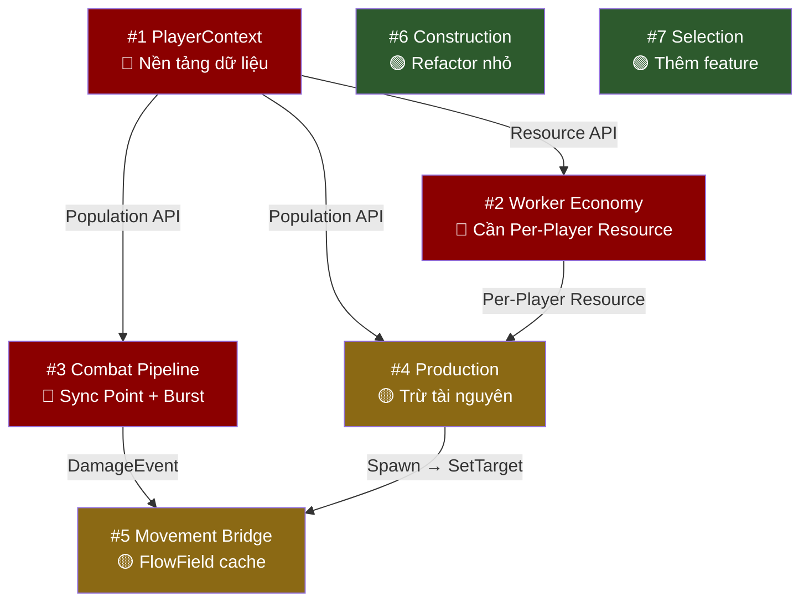

# 📌 THỨ TỰ ƯU TIÊN CẢI TIẾN & DỰ KIẾN CÔNG VIỆC

---

## TỔNG QUAN THỨ TỰ

```
  ƯU TIÊN                 HỆ THỐNG                     LÝ DO
  ━━━━━━━━━━━━━━━━━━━━━━━━━━━━━━━━━━━━━━━━━━━━━━━━━━━━━━━━━━━━━━━━━
  #1  🔴 PlayerContext     ← Nền tảng dữ liệu, MỌI system khác phụ thuộc
  #2  🔴 Worker Economy    ← Phụ thuộc PlayerContext, PvP hỏng hoàn toàn
  #3  🔴 Combat Pipeline   ← Sync Point + thiếu Burst, ảnh hưởng FPS nặng
  #4  🟡 Production        ← Phụ thuộc PlayerContext, thiếu trừ tài nguyên
  #5  🟡 Movement Bridge   ← FlowField tràn cache khi spawn hàng loạt
  #6  🟢 Construction      ← Chỉ cần refactor nhỏ
  #7  🟢 Selection         ← Hoạt động tốt, chỉ thêm feature
```

### Biểu đồ phụ thuộc giữa các hệ thống



> [!IMPORTANT]
> **PlayerContext phải sửa trước tiên** vì nó là lớp dữ liệu nền tảng — Worker Economy, Production, Combat (death → population) đều gọi `PlayerContextHelper`. Nếu sửa các system con trước mà PlayerContext vẫn tạo query/boxing mỗi lần gọi thì công sức sửa sẽ bị lãng phí.

---

## #1 — 🔴 PLAYERCONTEXT SYSTEM (Ưu tiên cao nhất)

**Lý do xếp đầu:** Là nền tảng dữ liệu trung tâm. 3+ system khác (HousePopulation, Production, HealthDeadTest) đều gọi `PlayerContextHelper` → sửa ở đây sẽ tự động fix performance cho tất cả consumer.

### Dự kiến cải tiến

| # | Việc cần làm | File ảnh hưởng | Độ khó |
|---|-------------|----------------|--------|
| 1.1 | **Viết lại `PlayerContextHelper`**: Xóa boxing `object value` → dùng typed methods (`SetPopulation(int)`, `SetAge(Age)`, `AddResource(ResourceType, int)`) | [PlayerContext.cs](file:///d:/Unity/TechTextAndChosingForRTS%20sample/Assets/Scripts/Game(New%20Simulation%20Logic)/System/PlayerContext/PlayerContext.cs) | ⭐⭐ |
| 1.2 | **Cache EntityQuery trong từng System** thay vì tạo mới trong Helper: mỗi system consumer tự giữ `EntityQuery` trong `OnCreate` và truyền vào helper | PlayerContext.cs + tất cả consumer | ⭐⭐ |
| 1.3 | **Fix `PlayerContextSyncSystem`**: Cache `EventBus` trong field (load 1 lần trong `OnCreate`). Fix bug gán lại `contextcache[i] = cache` sau khi sửa struct | [PlayerContextSyncSystem.cs](file:///d:/Unity/TechTextAndChosingForRTS%20sample/Assets/Scripts/Game(New%20Simulation%20Logic)/System/PlayerContext/PlayerContextSyncSystem.cs) | ⭐ |
| 1.4 | **Fix `DeletePlayerContext`**: Sửa query để quét đúng entity `Unit` thay vì `PlayerContext` | [PlayerContext.cs](file:///d:/Unity/TechTextAndChosingForRTS%20sample/Assets/Scripts/Game(New%20Simulation%20Logic)/System/PlayerContext/PlayerContext.cs) | ⭐ |
| 1.5 | **Thống nhất naming**: `PlayerId`, `CIVILIZATION_ID`, `currentPopulation` → chọn 1 convention | [PlayerContext.cs](file:///d:/Unity/TechTextAndChosingForRTS%20sample/Assets/Scripts/Game(New%20Simulation%20Logic)/System/PlayerContext/PlayerContext.cs) | ⭐ |

**Kết quả kỳ vọng:** Loại bỏ hoàn toàn GC allocation từ PlayerContext. Tất cả consumer (HousePopulation, Production, HealthDeadTest) tự động nhanh hơn.

---

## #2 — 🔴 WORKER ECONOMY (Phụ thuộc #1)

**Lý do xếp thứ 2:** PvP hoàn toàn hỏng vì Singleton tài nguyên dùng chung. Phải sửa sau PlayerContext vì cần Per-Player Resource API mới.

### Dự kiến cải tiến

| # | Việc cần làm | File ảnh hưởng | Độ khó |
|---|-------------|----------------|--------|
| 2.1 | **Xóa toàn bộ `Debug.Log`** hoặc bọc `#if UNITY_EDITOR` → cho phép Burst Compile | [WorkerGatherSystem.cs](file:///d:/Unity/TechTextAndChosingForRTS%20sample/Assets/Scripts/Game(New%20Simulation%20Logic)/System/Economy/WorkerGatherSystem.cs) | ⭐ |
| 2.2 | **Tách `PlayerResourceData` thành Per-Player**: Chuyển từ Singleton chung → `DynamicBuffer<ResourcePair>` trên Entity `PlayerContext` của từng phe. Worker cộng tài nguyên theo `Unit.playerID` | WorkerGatherSystem.cs + [PlayerResourceAuthoring.cs](file:///d:/Unity/TechTextAndChosingForRTS%20sample/Assets/Scripts/Game(New%20Simulation%20Logic)/CoreECS/Authoring/Resource/PlayerResourceAuthoring.cs) + PlayerContextSyncSystem.cs | ⭐⭐⭐ |
| 2.3 | **Tối ưu `FindNearestDepot`**: Cache danh sách depot vào NativeList 1 lần đầu frame, rồi các worker tra cứu từ list đó thay vì mỗi worker query riêng | WorkerGatherSystem.cs | ⭐⭐ |
| 2.4 | **Xử lý mỏ cạn kiệt**: Khi `ResourceNode.Amount ≤ 0`, worker tự tìm mỏ cùng loại gần nhất hoặc chuyển sang Idle | WorkerGatherSystem.cs | ⭐⭐ |
| 2.5 | **Gắn `[BurstCompile]`** sau khi xóa Debug.Log | WorkerGatherSystem.cs | ⭐ |

**Kết quả kỳ vọng:** PvP hoạt động đúng. Worker system chạy Burst, FPS ổn định với 50+ workers.

---

## #3 — 🔴 COMBAT PIPELINE (Độc lập, sửa song song được)

**Lý do xếp thứ 3:** Có lỗi Sync Point nghiêm trọng nhất (EntityManager.Instantiate trong query loop) và nhiều file thiếu Burst. Nhưng không phụ thuộc PlayerContext nên **có thể sửa song song** với #1 và #2.

### Dự kiến cải tiến

| # | Việc cần làm | File ảnh hưởng | Độ khó |
|---|-------------|----------------|--------|
| 3.1 | **Thay `EntityManager.Instantiate` bằng ECB** trong hàm `SpawnBullet` | [TowerAttackSystem.cs](file:///d:/Unity/TechTextAndChosingForRTS%20sample/Assets/Scripts/Game(New%20Simulation%20Logic)/System/Combat/TowerAttackSystem.cs), [TwinShootAttackSystem.cs](file:///d:/Unity/TechTextAndChosingForRTS%20sample/Assets/Scripts/Game(New%20Simulation%20Logic)/System/Combat/TwinShootAttackSystem.cs) | ⭐⭐ |
| 3.2 | **Hợp nhất `TwinShootAttackSystem` vào `TowerAttackSystem`**: TwinShoot chỉ là Tower với 2 weapon slot → dùng chung `DynamicBuffer<WeaponSlot>` | TwinShootAttackSystem.cs → xoá, TowerAttackSystem.cs | ⭐⭐ |
| 3.3 | **Thêm `healthAmount > 0`** vào `IsValidTarget` (ShootAttack) và `IsWantedTarget` (FindTarget) | [ShootAttackSystem.cs](file:///d:/Unity/TechTextAndChosingForRTS%20sample/Assets/Scripts/Game(New%20Simulation%20Logic)/System/Combat/ShootAttackSystem.cs), [FindTargetSystem.cs](file:///d:/Unity/TechTextAndChosingForRTS%20sample/Assets/Scripts/Game(New%20Simulation%20Logic)/System/Combat/FindTargetSystem.cs) | ⭐ |
| 3.4 | **AOE dùng `CollisionWorld.OverlapSphere`** thay vì quét toàn map + thêm `BuildingData` vào query AOE | [ArtilleryBulletMoverSystem.cs](file:///d:/Unity/TechTextAndChosingForRTS%20sample/Assets/Scripts/Game(New%20Simulation%20Logic)/System/Combat/ArtilleryBulletMoverSystem.cs) | ⭐⭐ |
| 3.5 | **Dùng `math.normalizesafe`** thay `math.normalize` khi tính hướng đạn | [BulletMoverSystem.cs](file:///d:/Unity/TechTextAndChosingForRTS%20sample/Assets/Scripts/Game(New%20Simulation%20Logic)/System/Combat/BulletMoverSystem.cs) | ⭐ |
| 3.6 | **HealthBarSystem**: Thay `Camera.main` bằng Singleton `CameraForwardComponent` (cập nhật 1 lần/frame từ MonoBehaviour). Thêm `SystemAPI.Exists` check | [HealthBarSystem.cs](file:///d:/Unity/TechTextAndChosingForRTS%20sample/Assets/Scripts/Game(New%20Simulation%20Logic)/System/Combat/HealthBarSystem.cs) | ⭐⭐ |
| 3.7 | **HealthDeadTestSystem**: Cache `EntityQuery` trong `OnCreate`. Di chuyển `BuildingCostArea` ra file riêng | [HealthDeadTestSystem.cs](file:///d:/Unity/TechTextAndChosingForRTS%20sample/Assets/Scripts/Game(New%20Simulation%20Logic)/System/Combat/HealthDeadTestSystem.cs) | ⭐ |
| 3.8 | **Thêm staggered timer** cho FindTarget: `timer = timerMax + random(0, 0.2f)` khi spawn | [FindTargetSystem.cs](file:///d:/Unity/TechTextAndChosingForRTS%20sample/Assets/Scripts/Game(New%20Simulation%20Logic)/System/Combat/FindTargetSystem.cs) | ⭐ |
| 3.9 | **Gắn `[BurstCompile]`** cho ShootAttack, TowerAttack, HealthBar, HealthDeadTest (sau khi xoá managed code) | 5 file | ⭐⭐ |
| 3.10 | **(Tương lai) Tạo `DamageEventSystem`**: Buffer `DamageEvent` thay vì sửa trực tiếp `health.healthAmount` — cho phép thêm armor/shield/buff | File mới | ⭐⭐⭐ |

**Kết quả kỳ vọng:** Xoá hoàn toàn Sync Point. 6/8 file Combat chạy Burst. AOE từ O(M×N) → O(M×K) với K = số entity trong vùng nổ.

---

## #4 — 🟡 PRODUCTION SYSTEM (Phụ thuộc #1 + #2)

**Lý do xếp thứ 4:** Logic cơ bản đúng nhưng thiếu trừ tài nguyên. Cần đợi #1 (PlayerContext API mới) và #2 (Per-Player Resource) xong trước.

### Dự kiến cải tiến

| # | Việc cần làm | File ảnh hưởng | Độ khó |
|---|-------------|----------------|--------|
| 4.1 | **Xoá `Debug.Log`/`LogWarning`** → cho phép Burst | [ProductionSystem.cs](file:///d:/Unity/TechTextAndChosingForRTS%20sample/Assets/Scripts/Game(New%20Simulation%20Logic)/System/Construction/ProductionSystem.cs) | ⭐ |
| 4.2 | **Thêm logic trừ tài nguyên** khi bắt đầu sản xuất (dùng Per-Player Resource API mới từ #2) | ProductionSystem.cs | ⭐⭐ |
| 4.3 | **Dùng PlayerContext API mới** (typed methods từ #1) thay vì `PlayerContextHelper` cũ | ProductionSystem.cs | ⭐ |
| 4.4 | **Sửa lỗi chính tả** `untiComponentOfBuilding` → `unitComponentOfBuilding` | ProductionSystem.cs | ⭐ |
| 4.5 | **Gắn `[BurstCompile]`** | ProductionSystem.cs | ⭐ |

**Kết quả kỳ vọng:** Sản xuất lính trừ đúng tài nguyên, Burst compiled, zero GC.

---

## #5 — 🟡 MOVEMENT COMMAND BRIDGE (Độc lập)

**Lý do xếp thứ 5:** Core Movement (FlowField + ORCA) rất tốt, chỉ yếu ở lớp Command Bridge. Không block gameplay nhưng ảnh hưởng FPS khi spawn hàng loạt.

### Dự kiến cải tiến

| # | Việc cần làm | File ảnh hưởng | Độ khó |
|---|-------------|----------------|--------|
| 5.1 | **Fix `SetupUnitDefaultPositionSystem`**: Chỉ set `hastarget=false, velocity=0, isSettled=true` thay vì gọi `SetTarget` (tránh tạo FlowField thừa) | [SetupUnitDefaultPositionSystem.cs](file:///d:/Unity/TechTextAndChosingForRTS%20sample/Assets/Scripts/Game(New%20Simulation%20Logic)/Movement/SetupUnitDefaultPositionSystem.cs) | ⭐ |
| 5.2 | **Tối ưu `FlowFieldAssignmentSystem`**: Dùng `NativeHashMap<int2, Entity>` tra cứu FlowField theo targetCell thay vì O(N×M) query lồng. Gắn `[BurstCompile]` | [FlowFieldAssignmentSystem.cs](file:///d:/Unity/TechTextAndChosingForRTS%20sample/Assets/Scripts/Game(New%20Simulation%20Logic)/MovementAgent/CommandBridge/FlowFieldAssignmentSystem.cs) | ⭐⭐⭐ |
| 5.3 | **Xoá `Complete()` + `Playback()` cưỡng bức**: Dùng `EntityCommandBufferSystem` thay vì tự playback | [MovementAgentPathRequestSystem.cs](file:///d:/Unity/TechTextAndChosingForRTS%20sample/Assets/Scripts/Game(New%20Simulation%20Logic)/MovementAgent/CommandBridge/MovementAgentPathRequestSystem.cs) | ⭐⭐ |
| 5.4 | **Xoá bake ContextSteering buffer** (32 phần tử không dùng) | [MovementAgentAuthoring.cs](file:///d:/Unity/TechTextAndChosingForRTS%20sample/Assets/Scripts/Game(New%20Simulation%20Logic)/MovementAgent/AgentMovementData/MovementAgentAuthoring.cs) | ⭐ |
| 5.5 | **Throttle `SetTarget` khi đuổi mục tiêu**: Chỉ gọi khi mục tiêu di chuyển ra ô grid khác, thay vì mỗi frame | [ShootAttackSystem.cs](file:///d:/Unity/TechTextAndChosingForRTS%20sample/Assets/Scripts/Game(New%20Simulation%20Logic)/System/Combat/ShootAttackSystem.cs) | ⭐⭐ |

**Kết quả kỳ vọng:** Spawn 100 lính không còn tràn FlowField cache. FlowFieldAssignment từ O(N×M) → O(1) lookup.

---

## #6 — 🟢 CONSTRUCTION SYSTEM (Refactor nhỏ)

**Lý do xếp thứ 6:** Hoạt động tốt, chỉ cần dọn dẹp code.

### Dự kiến cải tiến

| # | Việc cần làm | File ảnh hưởng | Độ khó |
|---|-------------|----------------|--------|
| 6.1 | **Gộp 2 vòng lặp LinkedEntityGroup** (lerp + completion) thành 1 | [ConstructionSystem.cs](file:///d:/Unity/TechTextAndChosingForRTS%20sample/Assets/Scripts/Game(New%20Simulation%20Logic)/System/Construction/ConstructionSystem.cs) | ⭐ |
| 6.2 | **Dùng PlayerContext API mới** cho HousePopulationSystem | [HousePopulationSystem.cs](file:///d:/Unity/TechTextAndChosingForRTS%20sample/Assets/Scripts/Game(New%20Simulation%20Logic)/System/Construction/HousePopulationSystem.cs) | ⭐ |
| 6.3 | **(Tương lai) Thêm Cancel Construction**: Huỷ xây giữa chừng, hoàn trả tài nguyên, clear grid cost | ConstructionSystem.cs + file mới | ⭐⭐ |

**Kết quả kỳ vọng:** Code sạch hơn, HousePopulation không còn GC allocation.

---

## #7 — 🟢 SELECTION SYSTEM (Thêm feature)

**Lý do xếp cuối:** Đã hoạt động tốt. Chỉ thiếu một số tính năng RTS thông dụng.

### Dự kiến cải tiến

| # | Việc cần làm | File ảnh hưởng | Độ khó |
|---|-------------|----------------|--------|
| 7.1 | **Implement `SelectionMode.Add`** (Shift+Click/Drag) | [SelectSystem.cs](file:///d:/Unity/TechTextAndChosingForRTS%20sample/Assets/Scripts/Game(New%20Simulation%20Logic)/System/SelectSystem/SelectSystem.cs) | ⭐⭐ |
| 7.2 | **Implement `SelectionMode.Remove`** (Ctrl+Click) | SelectSystem.cs | ⭐ |
| 7.3 | **Implement `SelectionMode.Clear`** (phím Esc) | SelectSystem.cs | ⭐ |
| 7.4 | **Sửa tên file** `SelecUISystem` → `SelectUISystem` | [SelecUISystem.cs](file:///d:/Unity/TechTextAndChosingForRTS%20sample/Assets/Scripts/Game(New%20Simulation%20Logic)/System/SelectSystem/SelecUISystem.cs) | ⭐ |
| 7.5 | **(Tương lai) Selection Groups**: Ctrl+1-9 gán nhóm, 1-9 gọi nhóm, Double-click chọn tất cả cùng loại | File mới + SelectSystem.cs | ⭐⭐⭐ |

**Kết quả kỳ vọng:** Trải nghiệm chọn quân đạt chuẩn RTS thương mại.

---

## TIMELINE DỰ KIẾN

```
  TUẦN 1                    TUẦN 2                    TUẦN 3                    TUẦN 4+
  ┌─────────────────────┐   ┌─────────────────────┐   ┌─────────────────────┐   ┌──────────────────┐
  │ #1 PlayerContext     │   │ #2 Worker Economy   │   │ #4 Production       │   │ #6 Construction  │
  │  1.1 Typed methods   │   │  2.1 Xoá Debug.Log  │   │  4.1-4.5 Trừ tài   │   │  6.1-6.3         │
  │  1.2 Cache query     │   │  2.2 Per-Player Res │   │  nguyên + Burst     │   │                  │
  │  1.3 Fix SyncSystem  │   │  2.3 Cache depot    │   │                     │   │ #7 Selection     │
  │  1.4 Fix Delete      │   │  2.4 Mỏ cạn        │   │ #5 Movement Bridge  │   │  7.1-7.5         │
  │  1.5 Naming          │   │  2.5 Burst          │   │  5.1-5.5            │   │                  │
  ├─────────────────────┤   ├─────────────────────┤   ├─────────────────────┤   ├──────────────────┤
  │ #3 Combat (SONG SONG)│   │ #3 Combat (tiếp)    │   │                     │   │                  │
  │  3.1 ECB thay EM     │   │  3.6 HealthBar      │   │                     │   │                  │
  │  3.2 Merge Twin      │   │  3.7 HealthDead     │   │                     │   │                  │
  │  3.3 Health > 0      │   │  3.8 Stagger timer  │   │                     │   │                  │
  │  3.4 AOE Sphere      │   │  3.9 Burst all      │   │                     │   │                  │
  │  3.5 normalizesafe   │   │  3.10 DamageEvent   │   │                     │   │                  │
  └─────────────────────┘   └─────────────────────┘   └─────────────────────┘   └──────────────────┘
         PHẢI LÀM                  PHẢI LÀM                   NÊN LÀM                CẢI TIẾN
```

> [!NOTE]
> **#1 PlayerContext** và **#3 Combat** có thể chạy **song song** vì không phụ thuộc nhau. Nếu có 2 người làm thì chia đôi được ngay tuần 1.
