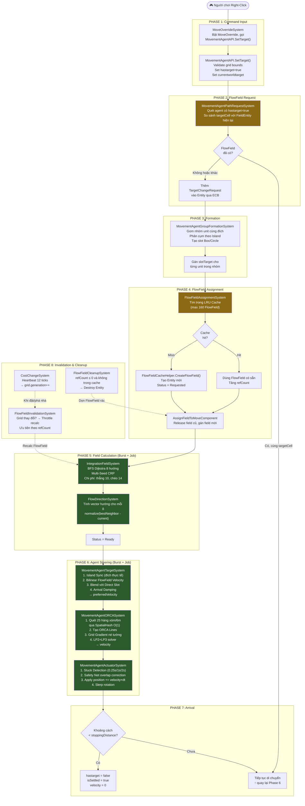
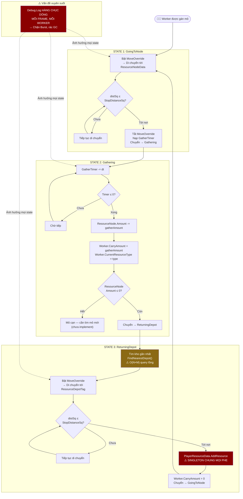
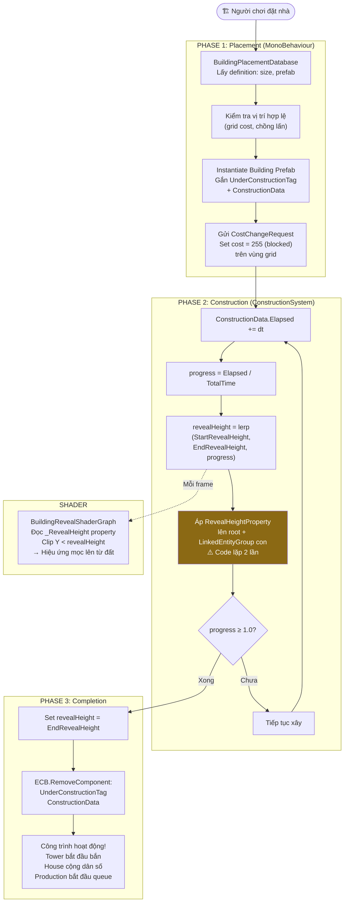
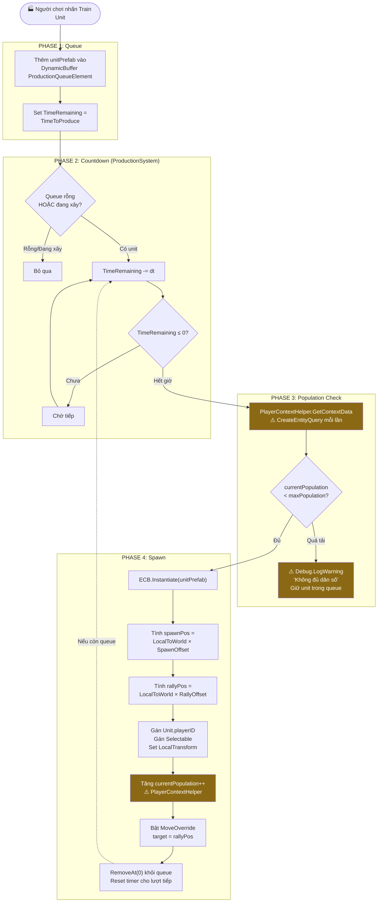
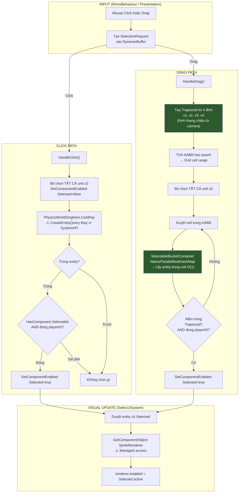
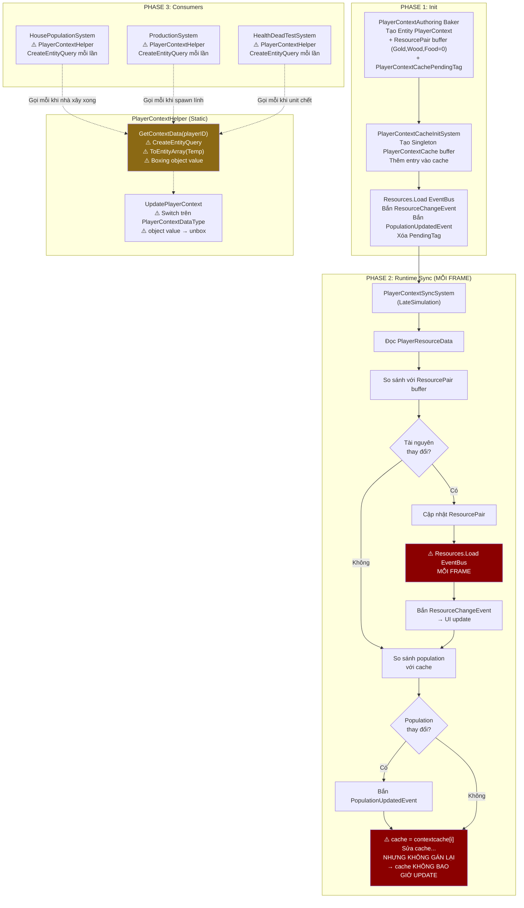

# 🔄 MÔ PHỎNG LOGIC FLOW — TỪNG HỆ THỐNG

Tài liệu này tách từng hệ thống, mô phỏng luồng thực thi thực tế dựa trên code đã đọc, và đánh giá điểm mạnh / yếu của từng flow.

---

## 1. MOVEMENT PIPELINE FLOW

Hệ thống di chuyển là pipeline phức tạp nhất, gồm **12 system** chạy tuần tự mỗi frame.

### ✅ Điểm mạnh

| # | Điểm mạnh | Chi tiết |
|---|-----------|----------|
| 1 | **Multi-Seed CRP** | Cho phép unit ở các đảo khác nhau vẫn tìm được đường tới đích gần nhất trên đảo của mình — rất hiếm thấy trong game RTS indie |
| 2 | **LRU Cache 160 FlowField** | Nhiều nhóm unit cùng đích sẽ chia sẻ 1 FlowField, không tính lại → tiết kiệm CPU cực lớn |
| 3 | **Heartbeat Rate-Limiting** | Gom 12 ticks cost change thành 1 lần generation++, tránh recalc FlowField liên tục khi đặt nhiều nhà |
| 4 | **ORCA LP2+LP3** | Giải pháp toán học chính xác cho tránh va chạm, không rung lắc (jitter) như Context Steering |
| 5 | **Stuck Detection thích ứng** | 3 mức ngưỡng (0.25s bị chặn gần / 1s trong formation / 2s ở xa) — xử lý triệt để deadlock khi dồn quân |
| 6 | **Burst + IJobEntity** | Phase 5+6 chạy đa luồng song song trên Worker Threads |
| 7 | **Throttled Invalidation** | Khi grid đổi, không recalc tất cả FlowField cùng lúc mà chia đều theo `RecalcPerframe`, ưu tiên field có nhiều quân dùng |

### ❌ Điểm yếu

| # | Điểm yếu | Hậu quả |
|---|-----------|---------|
| 1 | **SetupUnitDefaultPositionSystem tạo FlowField riêng cho MỖI unit spawn** | 100 lính spawn = 100 FlowField → tràn cache 160 → đẩy FlowField đang dùng ra ngoài |
| 2 | **FlowFieldAssignmentSystem: O(N×M) query lồng, thiếu Burst** | 50 unit cùng ra lệnh = query tất cả FlowField 50 lần tuần tự trên Main Thread |
| 3 | **MovementAgentPathRequestSystem: `Complete()` + `Playback()` cưỡng bức** | Block toàn bộ Job pipeline mỗi frame, tạo Sync Point |
| 4 | **ShootAttackSystem spam `SetTarget` mỗi frame khi đuổi** | Tạo TargetChangeRequest liên tục → làm nghẽn FlowFieldAssignment |
| 5 | **GridIslandSystem BFS trên Main Thread** | Map 256×256 = spike vài ms khi đặt công trình lớn |
| 6 | **Authoring vẫn bake 32 phần tử ContextSteering buffer** | Lãng phí ~128 bytes/entity cho hệ thống đã tắt |

---

## 2. COMBAT PIPELINE FLOW

```mermaid
flowchart TD
    subgraph "PHASE 1: Find Target"
        A1["FindTargetSystem<br/>Timer đếm ngược"]
        A2{"timer ≤ 0?"}
        A3["Reset timer = timerMax"]
        A4["CollisionWorld.OverlapSphere<br/>Layer: Units | Building<br/>Bán kính: range"]
        A5["Lọc: HasComponent Health<br/>+ playerID == wantedPlayerID"]
        A6["Tìm bestDistanceSq<br/>→ Gán target.targetEntity"]
        A7["Giữ target cũ"]
    end

    subgraph "PHASE 2: Attack Decision"
        B0{"Unit hay<br/>Tower?"}

        subgraph "Unit Path (ShootAttackSystem)"
            B1{"MoveOverride<br/>đang bật?"}
            B2["Bỏ qua auto-combat<br/>(micro hit-and-run)"]
            B3{"Trong tầm<br/>attackDistance?"}
            B4["MovementAgentAPI.SetTarget<br/>→ Đuổi theo mục tiêu<br/>⚠️ GỌI MỖI FRAME"]
            B5["MovementAgentAPI.StopAgent<br/>→ Dừng lại"]
            B6["Xoay Yaw theo mục tiêu<br/>rotationSpeed (default 10)"]
            B7{"math.dot ≥ 0.95?"}
        end

        subgraph "Tower Path (TowerAttackSystem)"
            C1{"Đang xây?<br/>UnderConstructionTag"}
            C2["Hủy target<br/>Quay về RestRotation"]
            C3{"Trong tầm<br/>AttackRange?"}
            C4["Xoay nòng về mục tiêu"]
            C5{"math.dot ≥ 0.98?"}
        end
    end

    subgraph "PHASE 3: Fire"
        D1["Duyệt DynamicBuffer<br/>WeaponSlot / UnitWeaponSlot"]
        D2{"CooldownTimer<br/>≤ 0?"}
        D3["Reset timer"]
        D4["SpawnProjectile qua ECB<br/>(ShootAttack)<br/>hoặc EntityManager.Instantiate<br/>(Tower) ⚠️ SYNC POINT"]
        D5["Gán vị trí nòng súng<br/>TransformPoint(MuzzleOffset)"]
        D6["Gán Bullet/ArtilleryBullet<br/>damage, speed, Target"]
    end

    subgraph "PHASE 4: Bullet Travel"
        E1{"Loại đạn?"}

        subgraph "Đạn thẳng (BulletMoverSystem)"
            E2["Tính hướng = normalize<br/>(targetPos - currentPos)<br/>⚠️ Nguy cơ NaN"]
            E3["position += dir × speed × dt"]
            E4["Overshoot prevention:<br/>distAfter > distBefore?<br/>→ Snap to target"]
            E5{"distSq ≤ 0.04?"}
            E6["health.healthAmount -= damage<br/>OnHealthChanged = true<br/>Destroy bullet"]
        end

        subgraph "Đạn pháo (ArtilleryBulletSystem)"
            E7["Nội suy XZ tuyến tính<br/>Y = 4h × t × (1-t) parabol"]
            E8{"t ≥ 1.0?"}
            E9["Tạo ExplosionEvent<br/>(pos, radiusSq, damage, playerID)"]
            E10["Quét TẤT CẢ Unit trong World<br/>⚠️ O(M×N)"]
            E11{"distSq ≤ radiusSq<br/>AND khác playerID?"}
            E12["health -= aoeDamage<br/>OnHealthChanged = true"]
        end
    end

    subgraph "PHASE 5: Death & Cleanup"
        F1["HealthDeadTestSystem<br/>(LateSimulation)"]
        F2{"healthAmount ≤ 0?"}
        F3["GetDestroyRoot<br/>Duyệt ngược Parent 16 cấp"]
        F4{"Là Unit hay<br/>Building?"}
        F5["Giảm currentPopulation<br/>qua PlayerContextHelper"]
        F6["Gửi CostChangeRequest<br/>clear grid (cost=1)<br/>⚠️ CreateEntityQuery"]
        F7["Destroy LinkedEntityGroup<br/>qua ECB"]
    end

    subgraph "PHASE 6: Reset"
        G1["ResetTargetSystem<br/>Target chết → Null"]
        G2["ResetEventSystem (OrderLast)<br/>OnHealthChanged = false"]
    end

    A1 --> A2
    A2 -- "Có" --> A3 --> A4 --> A5 --> A6
    A2 -- "Chưa" --> A7

    A6 --> B0
    B0 -- "Unit" --> B1
    B0 -- "Tower" --> C1

    B1 -- "Có" --> B2
    B1 -- "Không" --> B3
    B3 -- "Ngoài tầm" --> B4
    B3 -- "Trong tầm" --> B5 --> B6 --> B7
    B7 -- "Chưa đủ" --> B6
    B7 -- "Đủ" --> D1

    C1 -- "Đang xây" --> C2
    C1 -- "Xây xong" --> C3
    C3 -- "Ngoài tầm" --> C2
    C3 -- "Trong tầm" --> C4 --> C5
    C5 -- "Chưa đủ" --> C4
    C5 -- "Đủ" --> D1

    D1 --> D2
    D2 -- "Chưa" --> D3
    D2 -- "Sẵn sàng" --> D4 --> D5 --> D6

    D6 --> E1
    E1 -- "Bullet" --> E2 --> E3 --> E4 --> E5
    E5 -- "Chưa" --> E3
    E5 -- "Trúng" --> E6
    E1 -- "Artillery" --> E7 --> E8
    E8 -- "Chưa" --> E7
    E8 -- "Chạm đất" --> E9 --> E10 --> E11
    E11 -- "Có" --> E12
    E11 -- "Không" --> E10

    E6 --> F1
    E12 --> F1
    F1 --> F2
    F2 -- "Có" --> F3 --> F4
    F4 -- "Unit" --> F5 --> F7
    F4 -- "Building" --> F6 --> F7
    F2 -- "Còn sống" --> G1 --> G2

    style D4 fill:#8B0000,color:#fff
    style E10 fill:#8B0000,color:#fff
    style E2 fill:#8B6914,color:#fff
    style F6 fill:#8B6914,color:#fff
```

### ✅ Điểm mạnh

| # | Điểm mạnh |
|---|-----------|
| 1 | **Timer-based FindTarget** — không quét mỗi frame, giảm tải CPU |
| 2 | **OverlapSphere + Physics Layer** — lọc chính xác qua collision system thay vì brute-force |
| 3 | **Hỗ trợ micro hit-and-run** — `MoveOverride` ưu tiên hơn auto-combat, cho phép micro skill |
| 4 | **ShootVictim hit offset** — đạn bay đến đúng điểm trên mô hình 3D thay vì tâm entity |
| 5 | **Overshoot prevention** — đạn bay nhanh sẽ không xuyên qua mục tiêu |
| 6 | **Đạn pháo parabol chân thực** — công thức `4h×t×(1-t)` tạo quỹ đạo đẹp |
| 7 | **Death cleanup dọn Grid** — nhà sập tự động clear cost trên FlowField grid |

### ❌ Điểm yếu

| # | Điểm yếu | Mức độ |
|---|-----------|--------|
| 1 | **Tower dùng `EntityManager.Instantiate` trong Query Loop** — Hard Sync Point | 🔴 Nghiêm trọng |
| 2 | **AOE quét O(M×N) toàn map** — không dùng SpatialHash/OverlapSphere | 🔴 Nghiêm trọng |
| 3 | **Bắn xác chết** — thiếu `healthAmount > 0` trong IsValidTarget | 🔴 |
| 4 | **ShootAttack spam SetTarget mỗi frame** khi đuổi mục tiêu | 🟡 |
| 5 | **FindTarget lag spike đồng bộ** — unit spawn cùng lúc → timer hết cùng lúc | 🟡 |
| 6 | **playerID cứng 2 phe** — không mở rộng được FFA 3-4 người chơi | 🟡 |
| 7 | **AOE bỏ sót Building** — query chỉ lọc `Unit`, không lọc `BuildingData` | 🟡 |
| 8 | **HealthDeadTest dùng `CreateEntityQuery` trong vòng lặp** | 🟡 |
| 9 | **5/8 file Combat không có Burst** | 🟡 |

---

## 3. WORKER ECONOMY FLOW

### ✅ Điểm mạnh

| # | Điểm mạnh |
|---|-----------|
| 1 | **State Machine rõ ràng** — 3 state tách biệt, dễ hiểu logic |
| 2 | **Auto-find nearest depot** — tự tìm kho gần nhất nếu TargetDepot null |
| 3 | **Tích hợp MoveOverride** — tận dụng hệ thống Movement sẵn có |

### ❌ Điểm yếu

| # | Điểm yếu | Mức độ |
|---|-----------|--------|
| 1 | **`Debug.Log` hàng chục dòng mỗi frame** — chặn Burst, GC pressure | 🔴 Nghiêm trọng |
| 2 | **Singleton `PlayerResourceData` chung mọi phe** — PvP hỏng hoàn toàn | 🔴 Nghiêm trọng |
| 3 | **`FindNearestDepot` O(N×M)** trong vòng lặp worker | 🟡 |
| 4 | **Không xử lý mỏ cạn kiệt** — worker sẽ kẹt hoặc hành vi undefined | 🟡 |
| 5 | **Không có animation state** — worker đào mỏ nhưng không có visual feedback | 🟢 |

---

## 4. CONSTRUCTION FLOW

### ✅ Điểm mạnh

| # | Điểm mạnh |
|---|-----------|
| 1 | **Shader Reveal đẹp** — nhà mọc lên từ đất, progress-driven |
| 2 | **Burst Compile** — ConstructionSystem đã được Burst |
| 3 | **Tích hợp Grid Cost** — khu vực nhà blocked pathfinding ngay khi đặt |
| 4 | **Tag-based state** — UnderConstructionTag cho phép các system khác (Tower, Production) dễ dàng check |

### ❌ Điểm yếu

| # | Điểm yếu | Mức độ |
|---|-----------|--------|
| 1 | **Code duyệt LinkedEntityGroup lặp 2 lần** — 1 lần cho lerp, 1 lần cho completion | 🟢 Minor |
| 2 | **Không có hủy xây dựng (Cancel)** — người chơi không thể hủy giữa chừng | 🟡 Thiếu feature |
| 3 | **Không trừ tài nguyên khi đặt nhà** — logic trừ resource chưa thấy trong ECS | 🟡 |

---

## 5. PRODUCTION FLOW

### ✅ Điểm mạnh

| # | Điểm mạnh |
|---|-----------|
| 1 | **Queue-based** — hỗ trợ sản xuất hàng loạt, FIFO |
| 2 | **Rally Point** — unit spawn tự động di chuyển tới điểm tập kết |
| 3 | **Population gate** — kiểm tra dân số trước khi sinh |
| 4 | **LocalToWorld transform** — spawn position/rally tính theo rotation của nhà |

### ❌ Điểm yếu

| # | Điểm yếu | Mức độ |
|---|-----------|--------|
| 1 | **`Debug.Log`/`Debug.LogWarning` chặn Burst** dù có `[BurstCompile]` | 🔴 |
| 2 | **Thiếu trừ tài nguyên** khi sản xuất lính (Gold, Wood, Food) | 🟡 Thiếu feature |
| 3 | **PlayerContextHelper tạo query mỗi lần** | 🟡 |
| 4 | **Lỗi chính tả** `untiComponentOfBuilding` | 🟢 |

---

## 6. SELECTION FLOW

### ✅ Điểm mạnh

| # | Điểm mạnh |
|---|-----------|
| 1 | **Trapezoid Selection xuất sắc** — dùng hình thang thay vì hình chữ nhật, chính xác với góc camera 3D |
| 2 | **SpatialHash O(1) lookup** — drag select hàng trăm unit không lag |
| 3 | **`IEnableableComponent` cho Selected** — không thay đổi Archetype, zero structural change khi chọn/bỏ chọn |
| 4 | **Physics Raycast cho Click** — chính xác theo collider thật, không phải bounding box |

### ❌ Điểm yếu

| # | Điểm yếu | Mức độ |
|---|-----------|--------|
| 1 | **Thiếu Add/Remove/Clear mode** — chưa implement Shift+Click, Ctrl+Click | 🟡 Thiếu feature |
| 2 | **SelecUISystem dùng Managed SpriteRenderer** — không Burst được | 🟡 |
| 3 | **Thiếu Selection Group** (Ctrl+1 gán nhóm, 1 gọi nhóm) | 🟡 Thiếu feature |
| 4 | **Tên file sai chính tả** `SelecUISystem` | 🟢 |

---

## 7. PLAYERCONTEXT FLOW

### ✅ Điểm mạnh

| # | Điểm mạnh |
|---|-----------|
| 1 | **Event-driven UI sync** — chỉ bắn event khi có thay đổi (ý tưởng đúng) |
| 2 | **Cleanup Component cho House** — `HousePopulationCleanup` tự động trừ dân số khi nhà bị phá |
| 3 | **Cache buffer pattern** — ý tưởng so sánh cache để phát hiện delta là đúng |

### ❌ Điểm yếu

| # | Điểm yếu | Mức độ |
|---|-----------|--------|
| 1 | **`Resources.Load` MỖI FRAME** trong `OnUpdate` | 🔴 Cực nghiêm trọng |
| 2 | **Buffer struct copy không gán lại** → cache vĩnh viễn giữ giá trị cũ → event bắn liên tục | 🔴 Cực nghiêm trọng |
| 3 | **`PlayerContextHelper` tạo EntityQuery + ToEntityArray mỗi lần gọi** — gọi từ 3+ system | 🔴 |
| 4 | **Boxing `object value`** trong UpdatePlayerContext | 🟡 |
| 5 | **Bug `DeletePlayerContext`** — query `PlayerContext` nhưng check `Unit` → logic sai | 🟡 |
| 6 | **Naming convention lộn xộn** trong cùng 1 struct | 🟢 |

---

## TỔNG KẾT XẾP HẠNG CHẤT LƯỢNG FLOW

| Hệ thống | Flow | Điểm mạnh | Điểm yếu | Đánh giá tổng |
|-----------|------|-----------|-----------|----------------|
| **Movement Pipeline** | 12 system, 8 phase | 7 | 6 | 🟢 **TỐT** — Core rất mạnh, yếu ở Command Bridge |
| **Selection** | 3 system, 3 path | 4 | 4 | 🟢 **TỐT** — Thiếu feature nhưng architecture tốt |
| **Construction** | 2 system, 3 phase | 4 | 3 | 🟢 **TỐT** — Shader reveal đẹp |
| **Production** | 1 system, 4 phase | 4 | 4 | 🟡 **TRUNG BÌNH** — Logic đúng, thiếu feature |
| **Combat Pipeline** | 8 system, 6 phase | 7 | 9 | 🟡 **CẦN SỬA** — Nhiều bug và thiếu Burst |
| **Worker Economy** | 1 system, 3 state | 3 | 5 | 🔴 **KÉM** — Debug.Log + Singleton chung |
| **PlayerContext** | 4 system, 3 phase | 3 | 6 | 🔴 **KÉM** — Resources.Load/frame + buffer bug |
